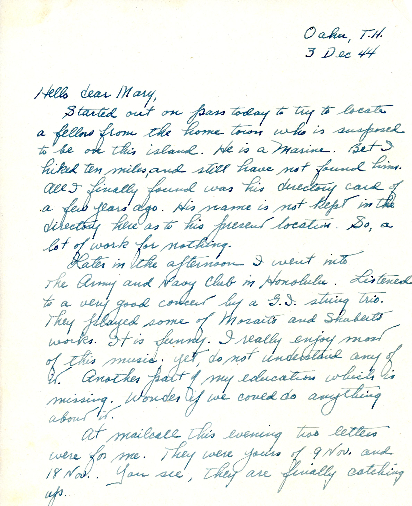
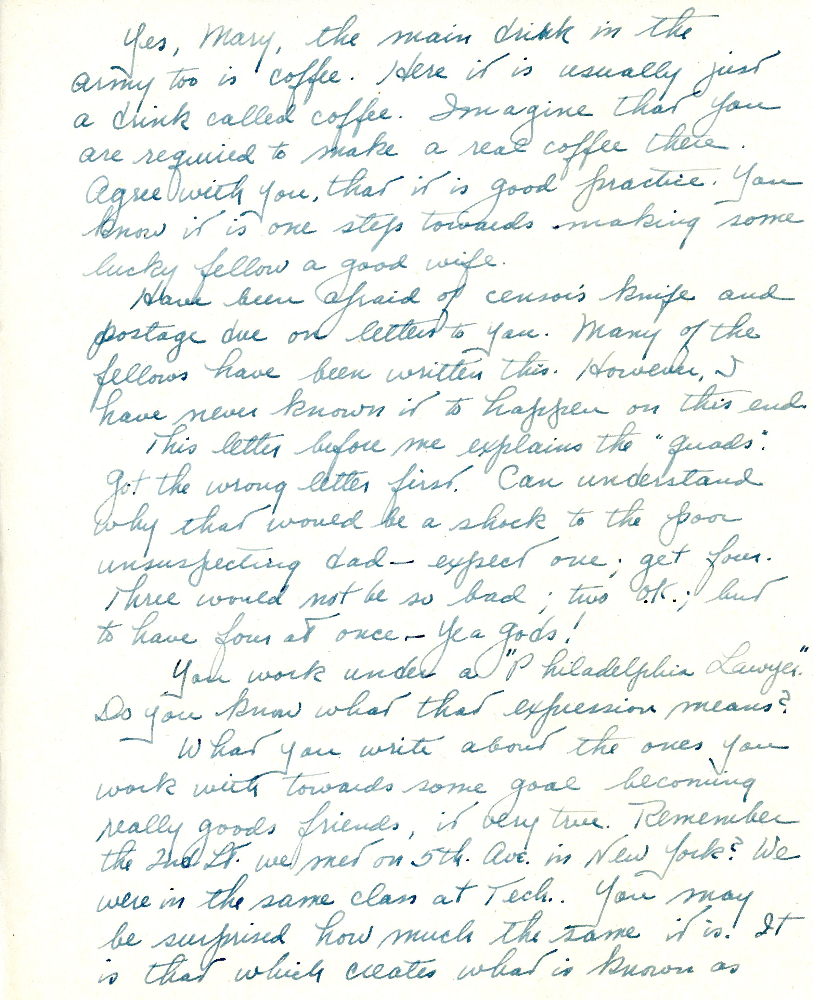
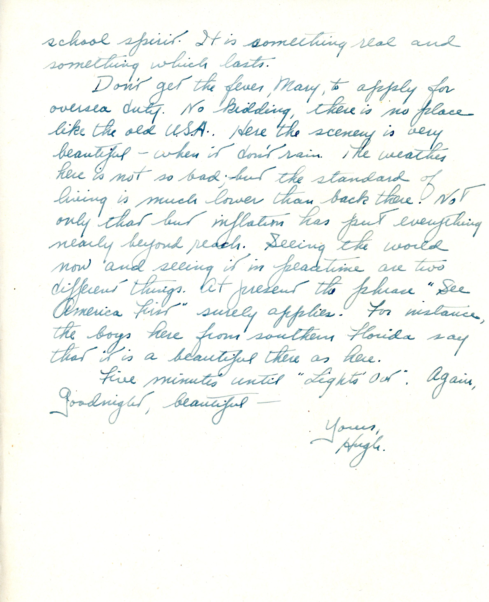

 {} Dad's comment on classical music (and uncharacteristic mis-spelling of "Mozart" and "Schubert") is interesting, as his mother took piano lessons from the same (by then, ancient) woman who taught me as I child.  I guess Gabrielle's interest on music wasn't passed along to Dad. {}

