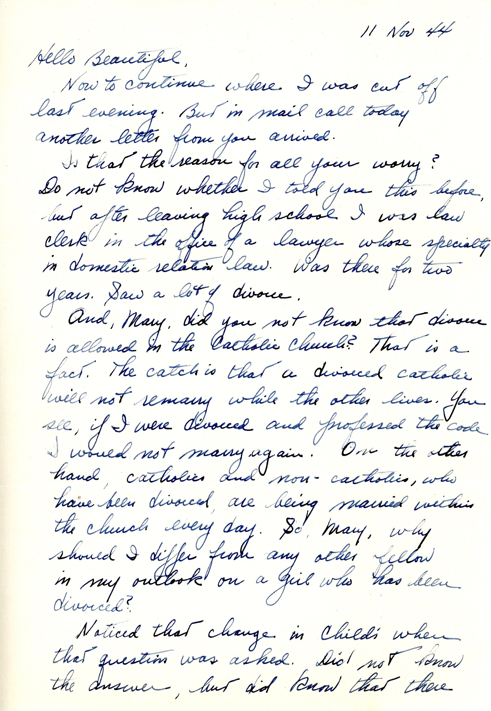
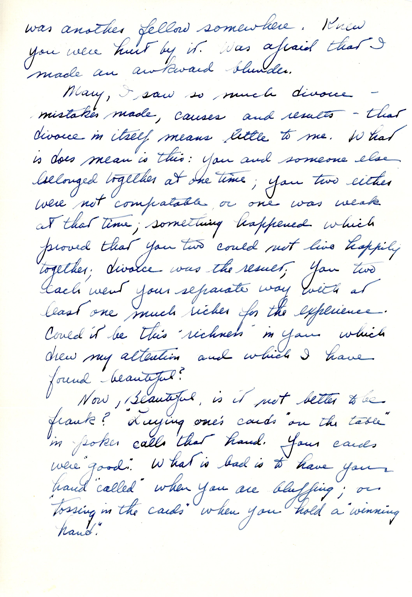
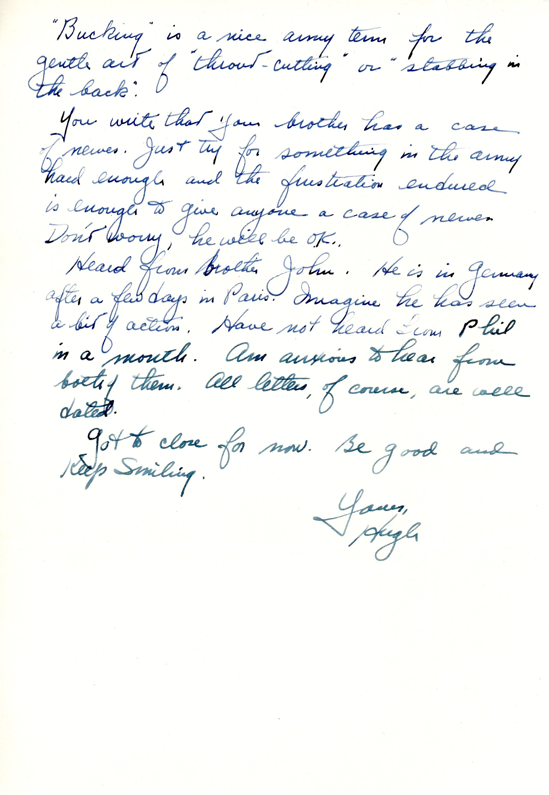

 
{}This letter seems to be the continuation of a letter begun the previous day, but I cannot find a corresponding item. Mary had evidently just written to Dad in the latest "mail call" about her first marriage, which she had walked out on in mid-1940, with the divorce finalized in late 1942. {}

{}The "law clerk in the office of a lawyer" phrase refers to his father's law office, who was thus both Catholic and a divorce lawyer {}

{}"Childs" was a chain of cafeteria-style restaurants in New York City, where Dad had evidently taken Mary on a date. {}

