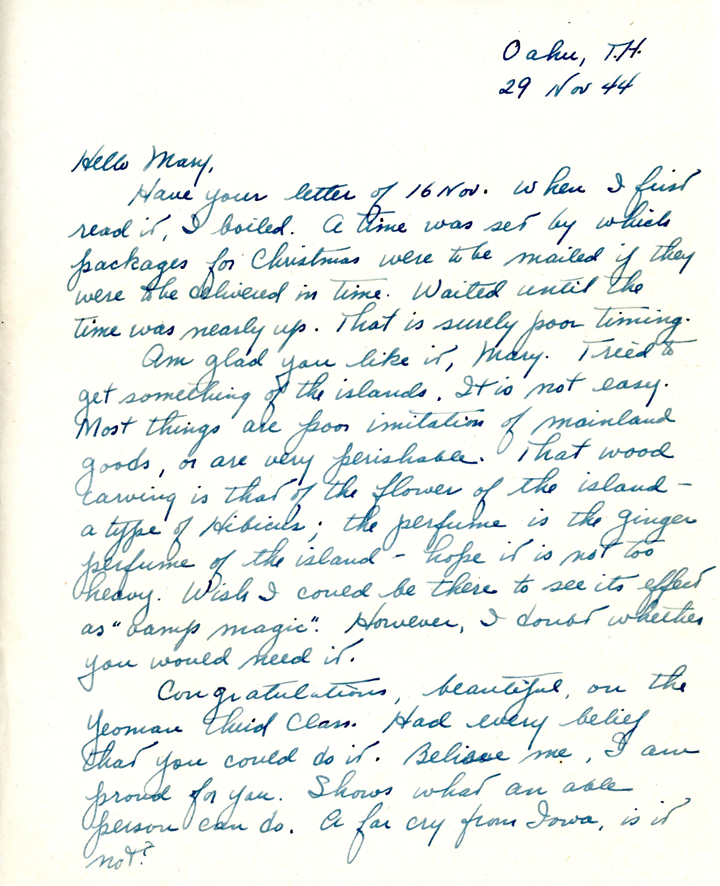
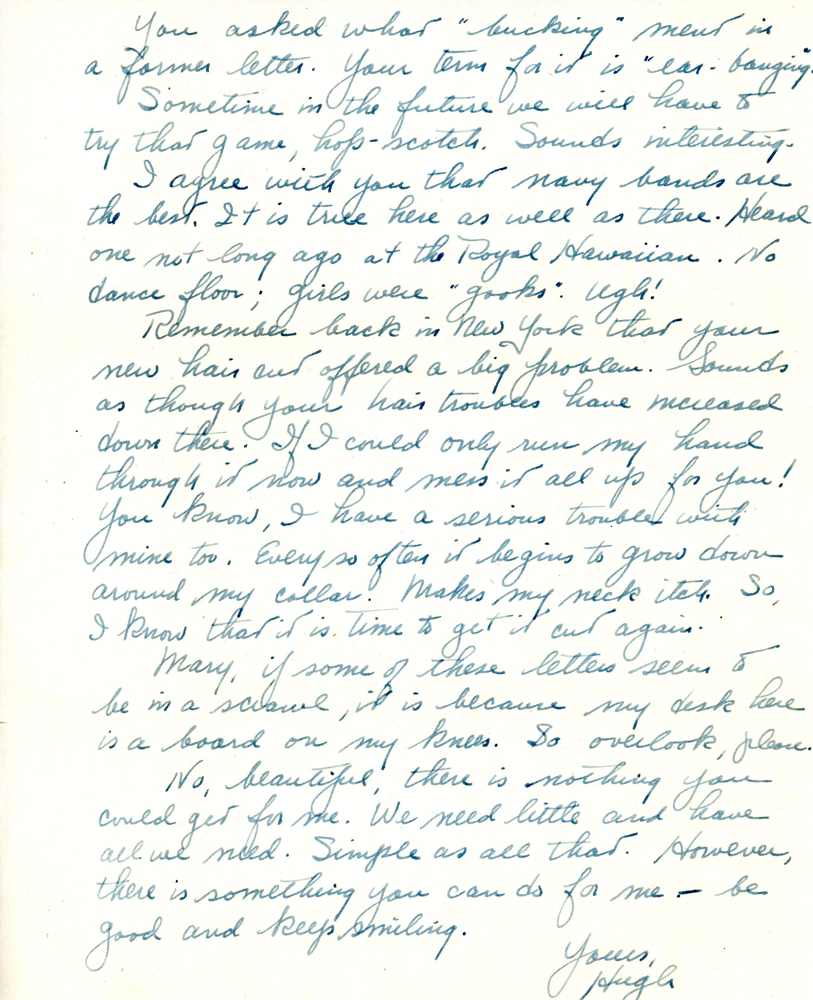

 

{} The Christmas present decribed in this letter (a carved Hawaiian wood perfume bottle holder with a wood-capped glass insert containing a trace of perfume) was on Mom's dresser until she died in 1994.  Unfortunately, I do not now know where it is, although I most likely still have it stored somewhere. {}

