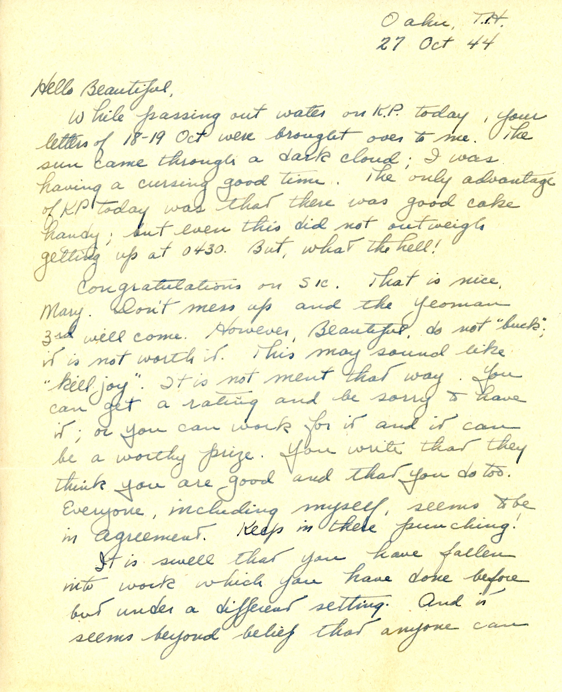
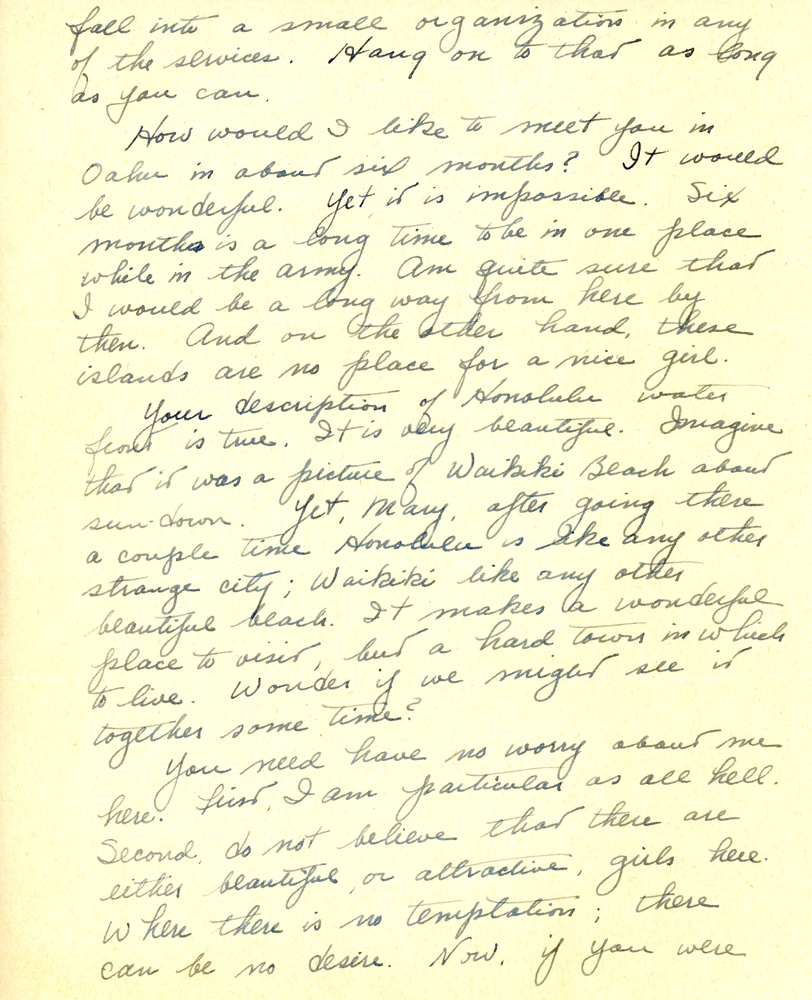
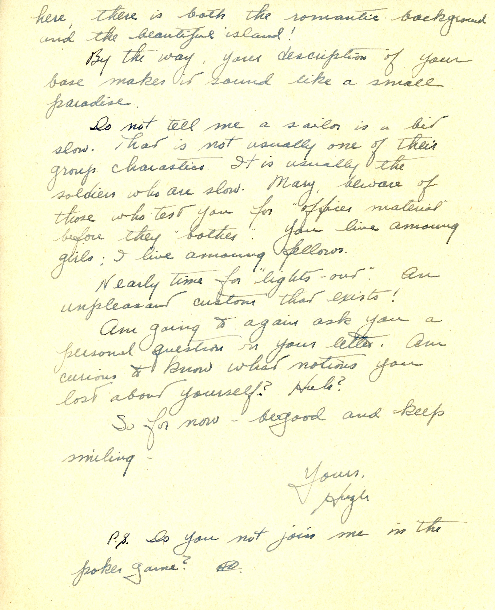

 
Mary has "rated" Seaman 1st Class, but...Dad is stuck on KP.

{}Dad had a KP story he told me.  He was at one time (although perhaps not this exact time) subject to a non-com during KP who was both a micro-manager and an individual with a deep loathing for "college boys."  To put an end to his antics, Dad and his "college boy" fellow-soldiers decided to do exactly and only exactly what the fellow commanded.  After chasing them around giving precise instructions just how to mop and where, his frustration and increasing vulgarity and volume attracted the attention of a higher-up, who quickly saw how things were and gave the non-com something else to supervise. No wonder Dad didn't do so well with the "ratings" {}

