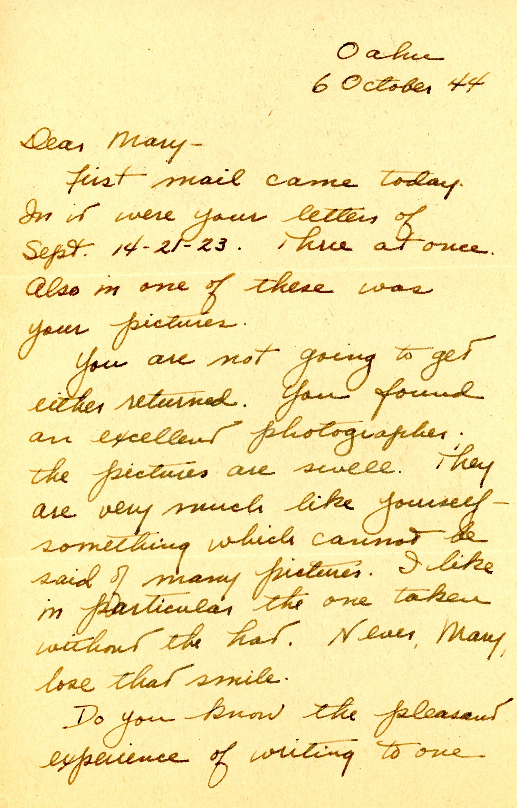
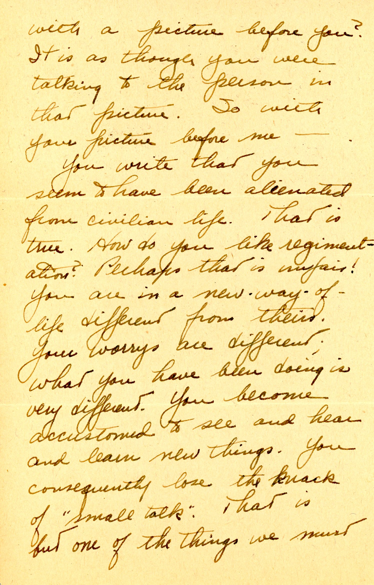
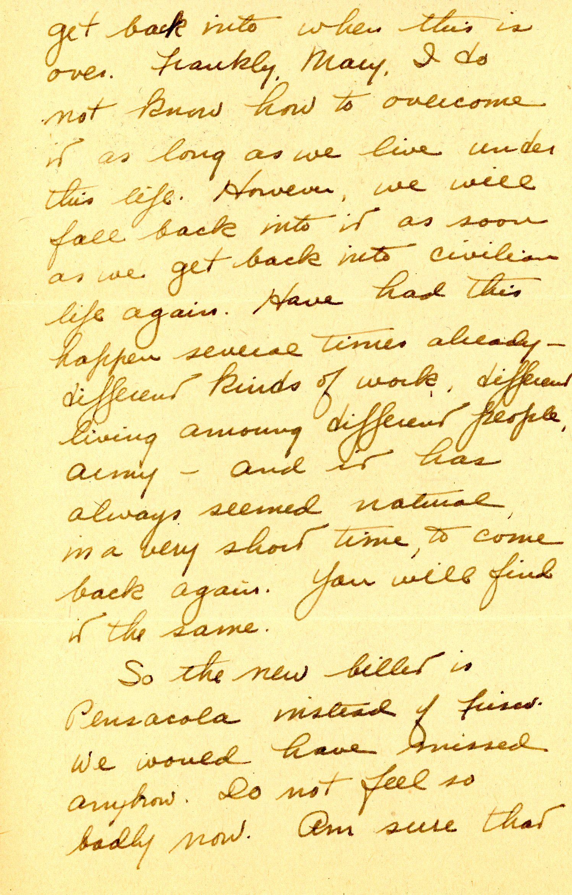
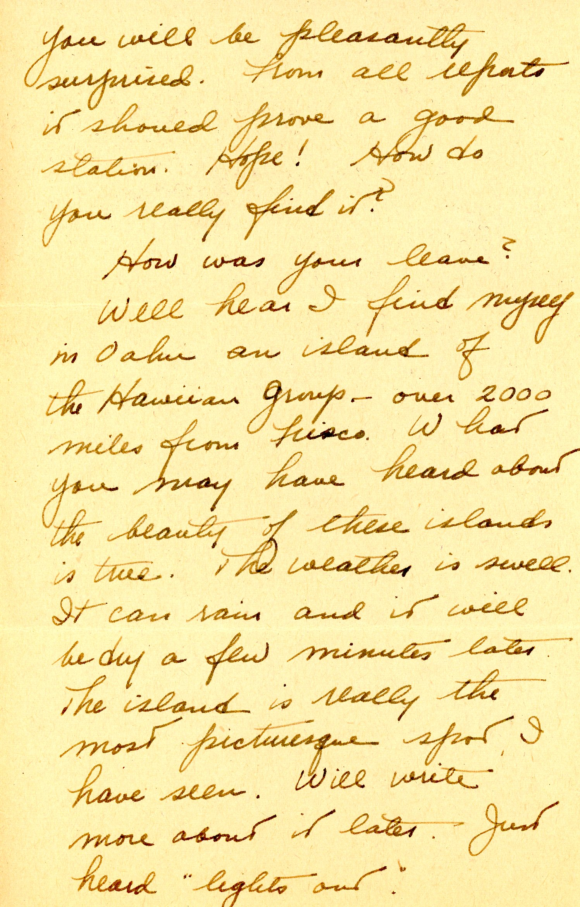
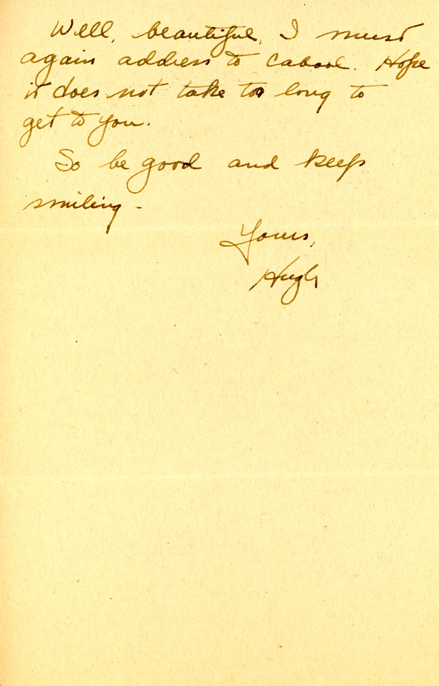

 
Dad has arrived in Oahu, Territory of Hawaii. The photo I added here matches the image Dad describes...no hat.  The with hat version is attached to the first of these letters.

| |
|:---:|
|*Mary Potter portrait, NAS Pensacola, Florida*|

