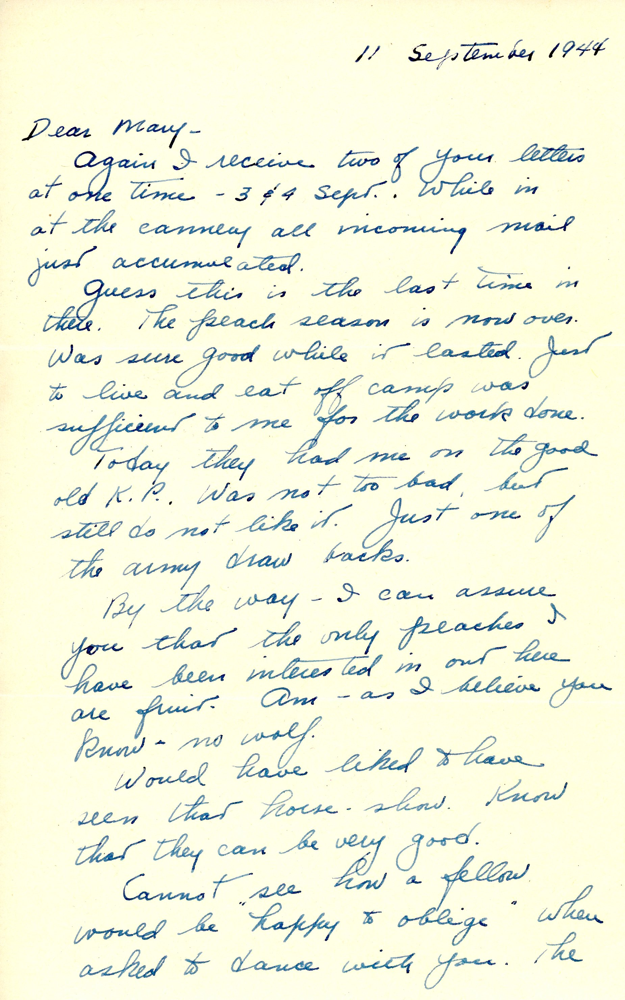
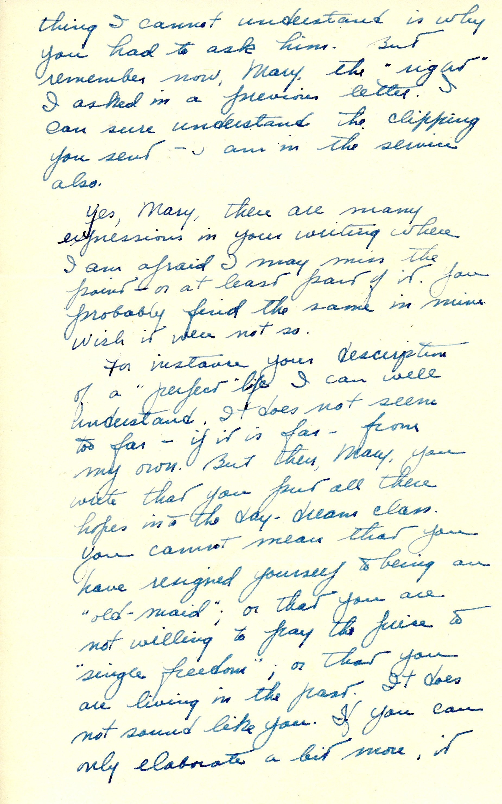
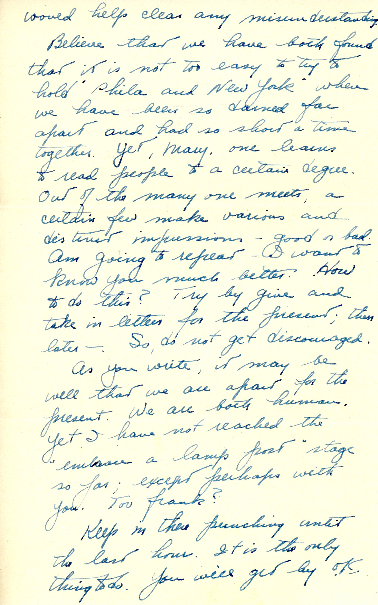
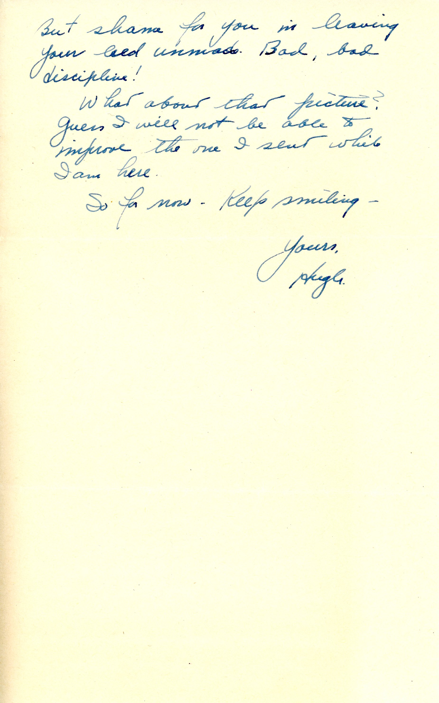

 
The next letter probably was mailed from San Francisco, CA as can be inferred from the next
letter, which was posted a few days later and with a proper location.  Evidently, the Army
needed to get the peach harvest in and canned! Something to do while waiting for the
inevitable westbound troop ship. Mary was, by then, at the Naval Air Station, 
Pensacola, Florida.

| |
|:---:|
|*Army Technician 4th Grade (T/4) Arm Patch*|

