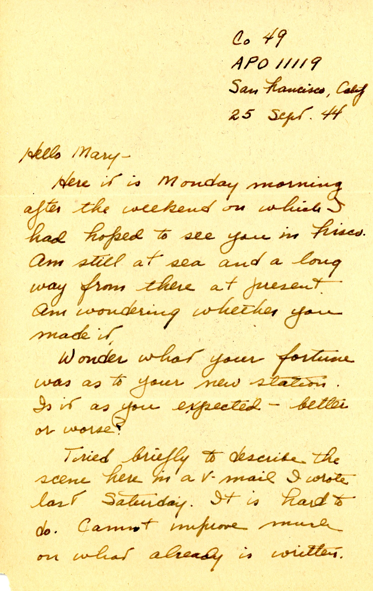
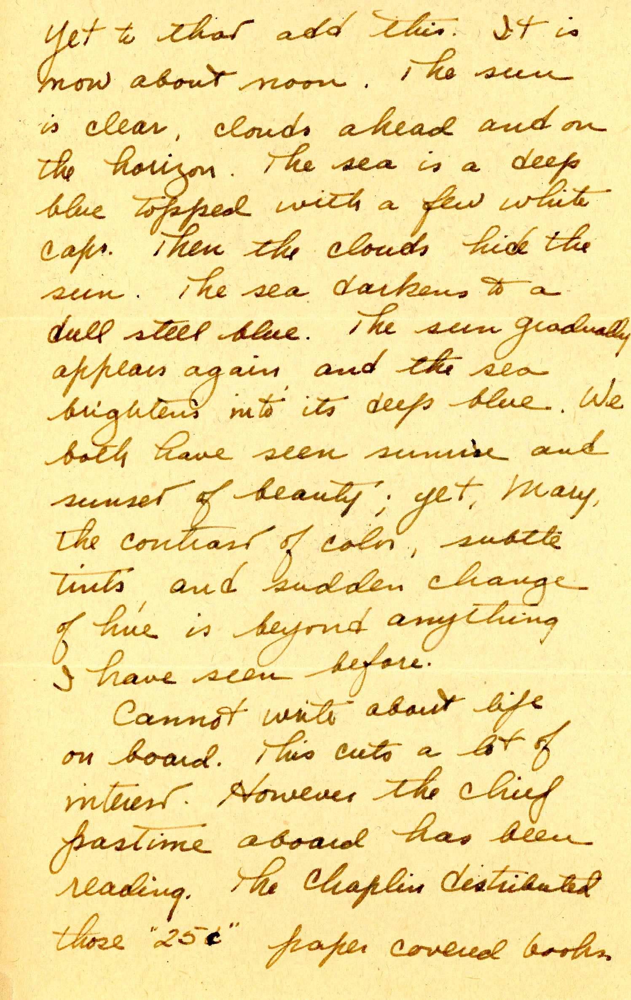
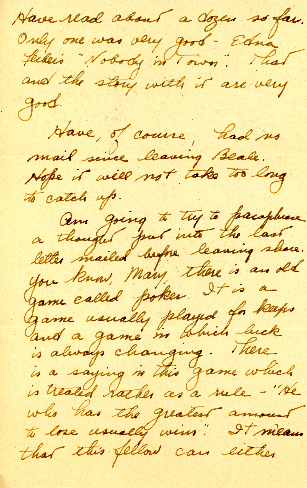
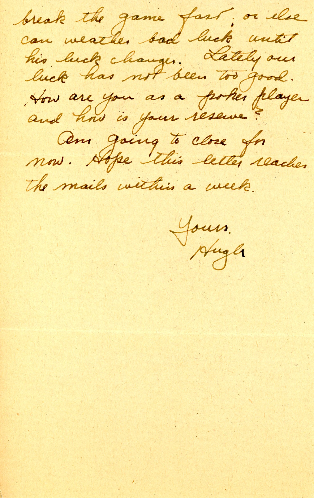

 
This letter was "mailed" on a troop transport ship heading for Hawaii, although return-addressed "San Francisco, CA." Dad had missed connections with Mom in San Francisco, assuming she had made any arrangements to go to "Frisco".

| |
|:---:|
|*Navy WAVES yeoman third classs patches, summer and winter*|

