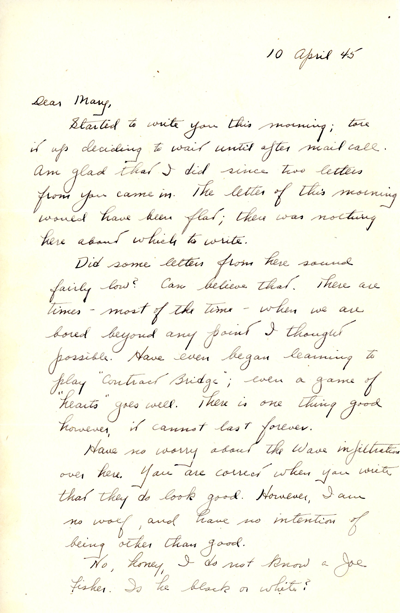
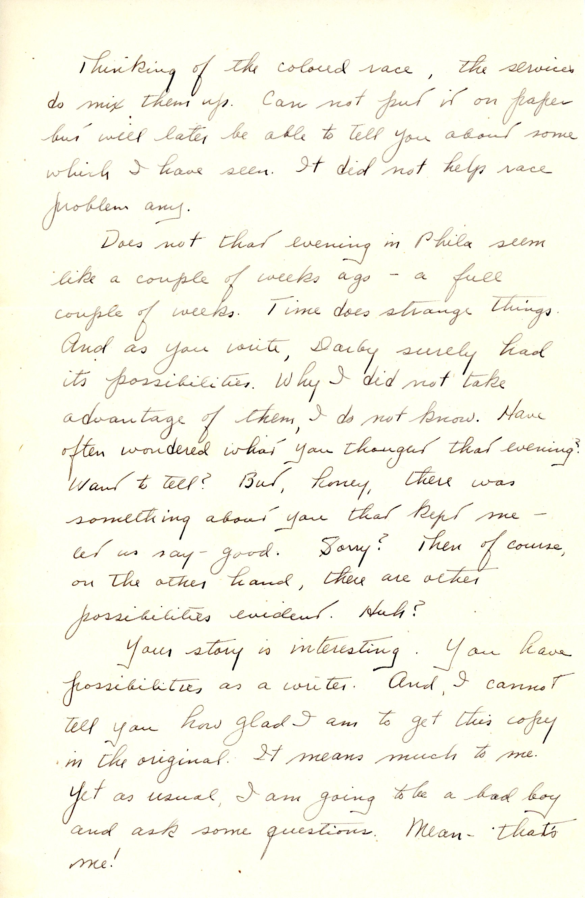
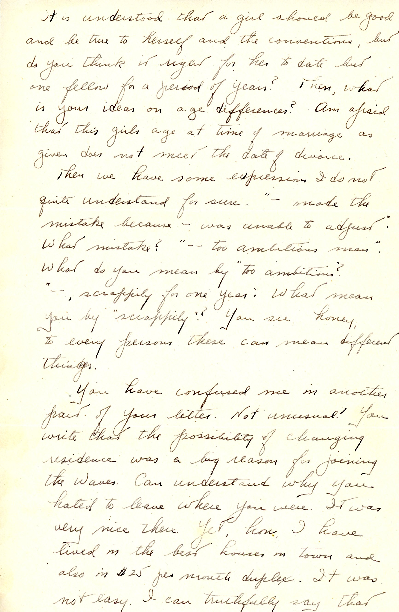
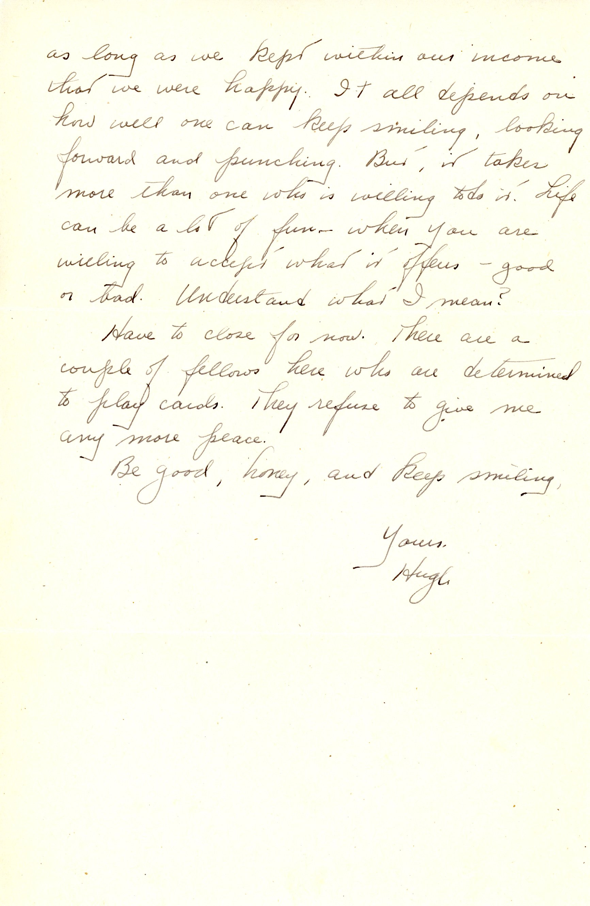

 {}Dad has finally gotten a "life story" letter back from Mary, but the "story"  apparently contained some inconsistent age data, and odd reasons for the end of her first marriage.  Dad is confused.   {}

| |
|:---:|
|*Glens Falls Homes...Samuel Lavery house (perhaps)...John Heffron house...Charlotte St Duplex (the RH one)|

