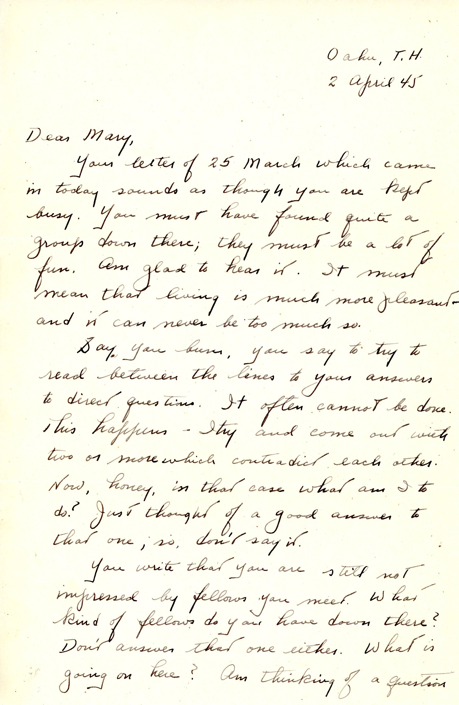
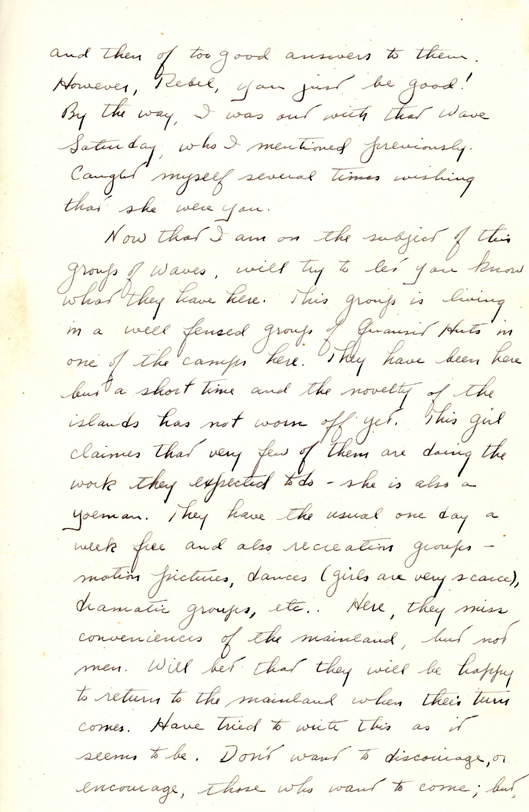
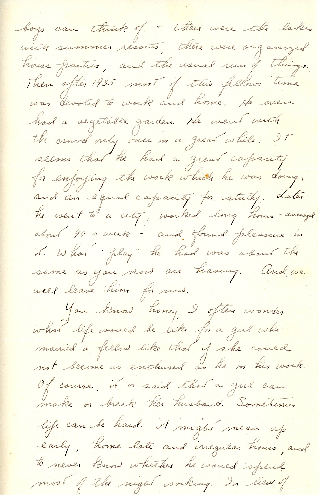
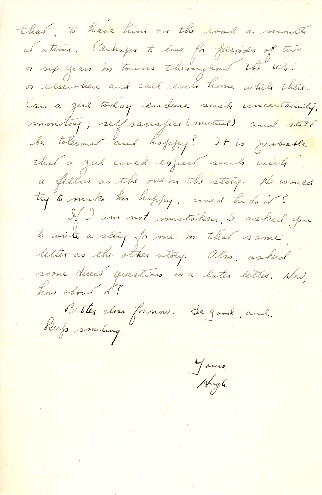

 {}Dad reports on his non-date with a WAVE (probably Dorothy Doane (1909-1990) as I mentioned last time.  He mostly relates how the WAVES live in Hawaii, in Quonset huts in a well-fenced area. Dad then continues the third-person narration of his biography of "that young fellow".  He also lays out an imagined future as a production engineer (which is generally what happened in terms of travel for work, although Dad had a single home base for his whole working life, mostly because when IP tried to move him (to their Corporate offices then in NYC) he simply never showed up.)  {}

