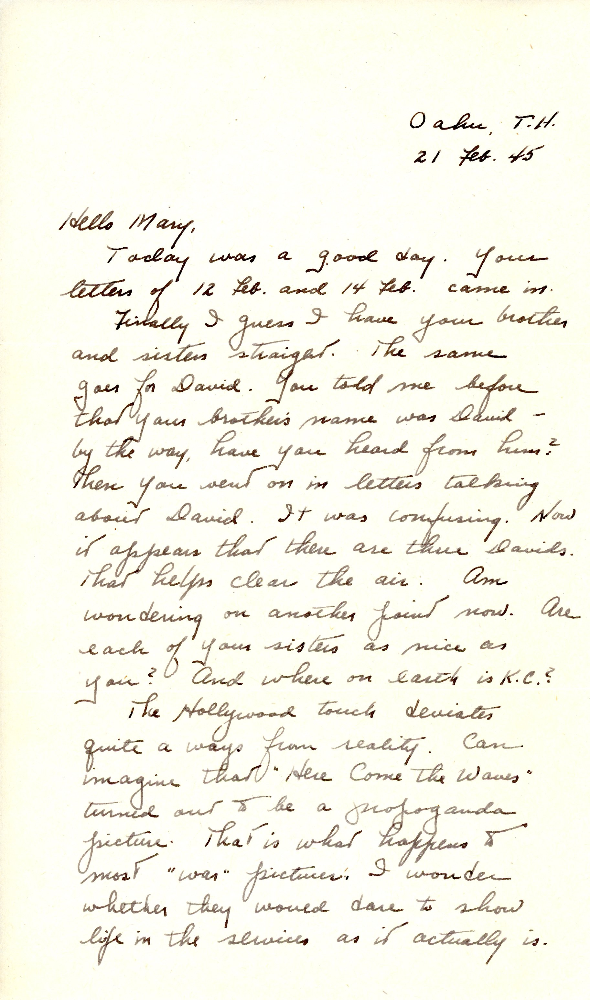
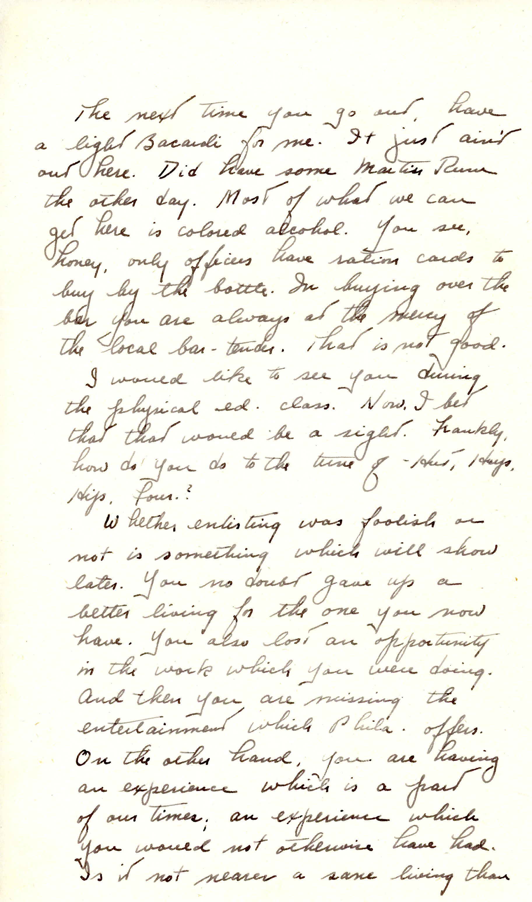
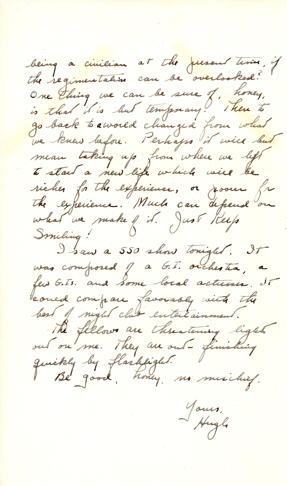

 {} Dad mentions "Here Come The Waves" which was filmed at Hunter College in NY (then a WAVES training facility.)  My Mom is in an early crowd shot of WAVES in uniform running down the front steps of Hunter.  The film otherwise featured Bing Crosby and Betty Hutton, and was most definitely a propaganda piece. Dad is confused about multiple Dave-s in Mary's letters, as well as the location of K.C. {}

