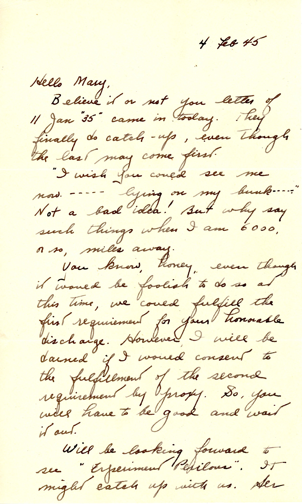
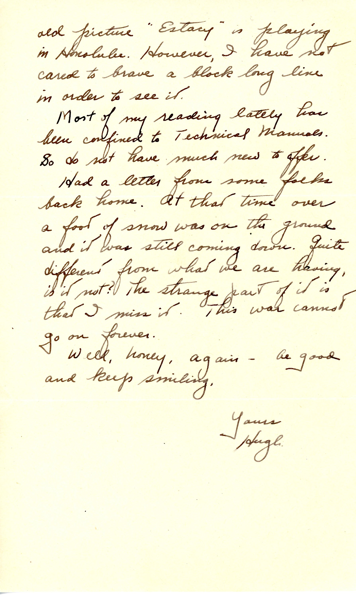
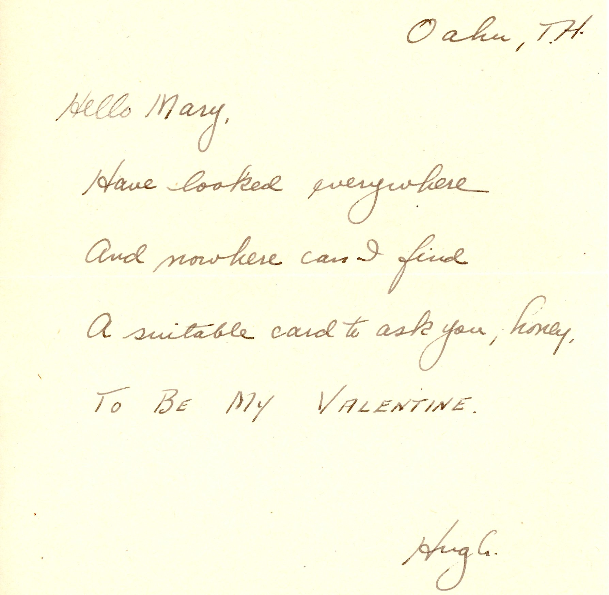

 {} The two movies Dad mentions below ("Experiment Perilous" and "Ecstasy") were both Hedy Lamarr films.  "Ecstasy" is still drawing long lines in 1945 Honolulu, even though it was released in 1933. Dad misses Winter back home in Glens Falls, NY. {}

