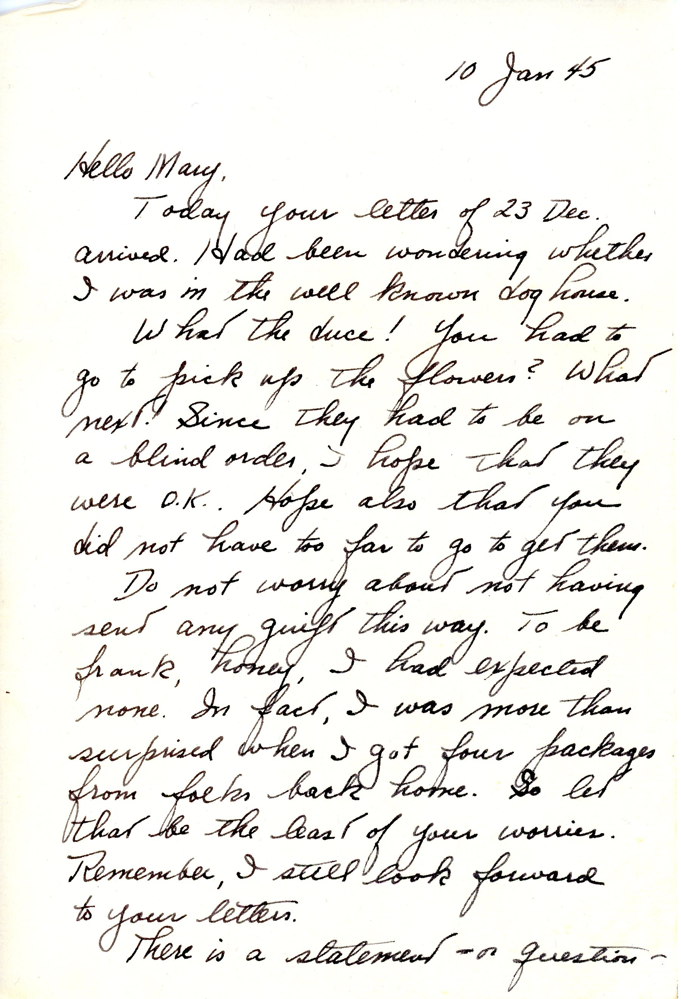
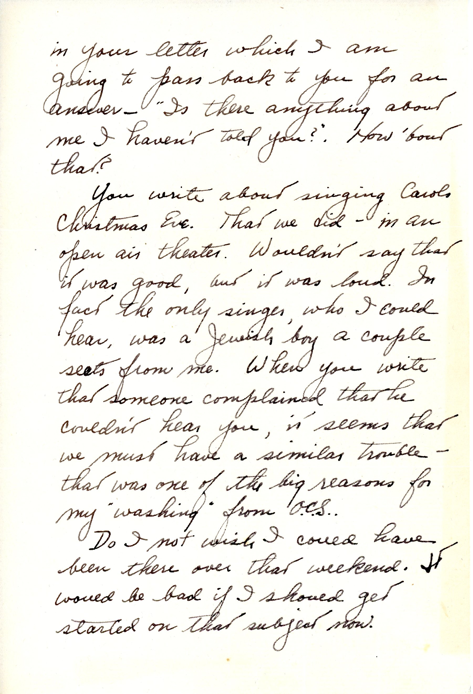
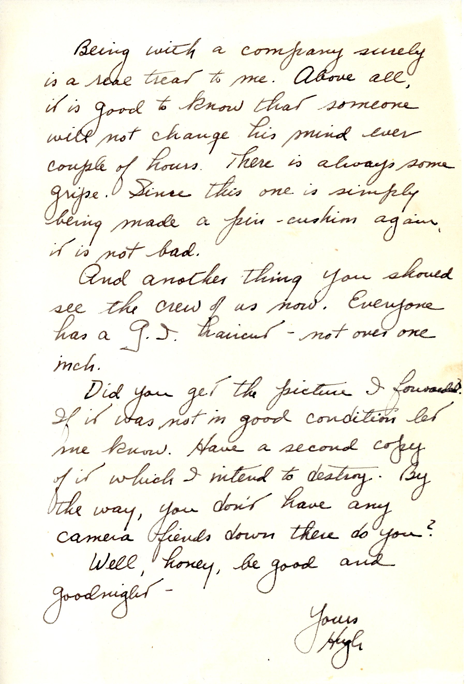

 {} This letter mentions again that OCS didn't work out for Dad because of speech issues.  Also, getting "shots" and a GI haircut.    {}

| |
|:---:|
|*Army Life even in Honolulu (fair use for genealogy*|

