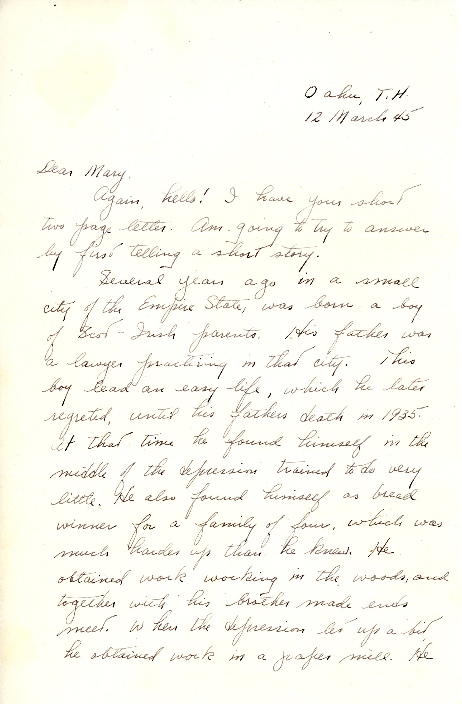
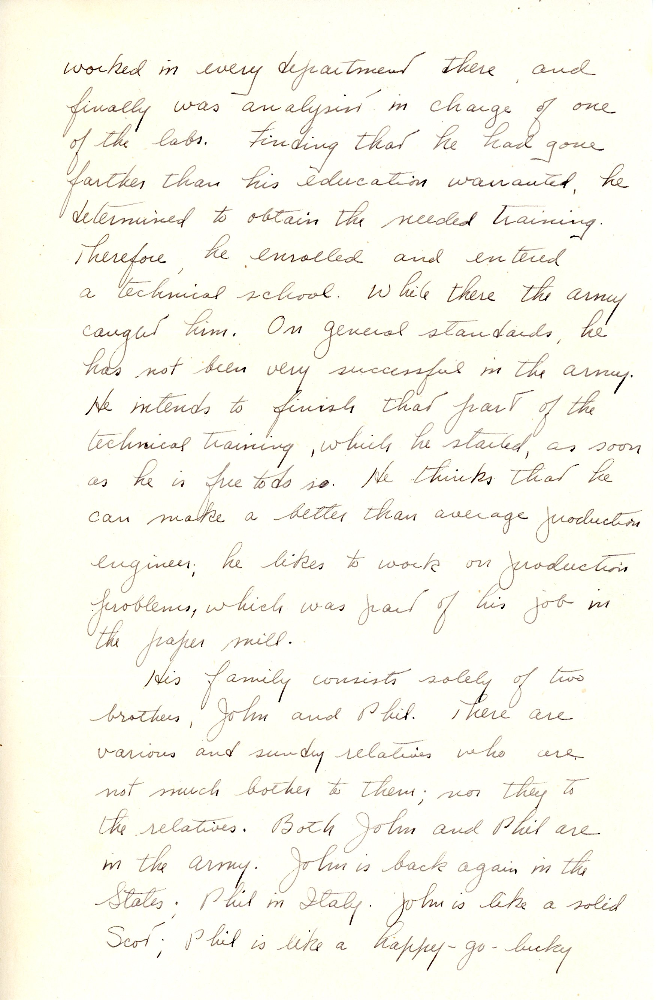
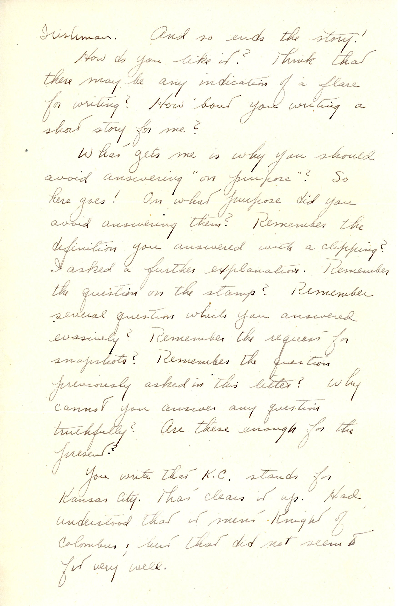
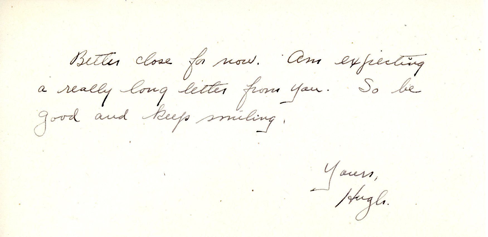

 {} This is one of my favorite letters.  First, Dad tells a "once upon a time" story about his own childhood and youth, presumably because he can't get any similar stories from Mary.  He moves on to an uncharacteristically blunt cross-examination as to why Mary "will not answer any questions truthfully."  {}

| |
|:---:|
|*Dad's brothers John Lavery and Phillip Lavery (Phil on the right, soldier with cigarette not id'd.)*|

