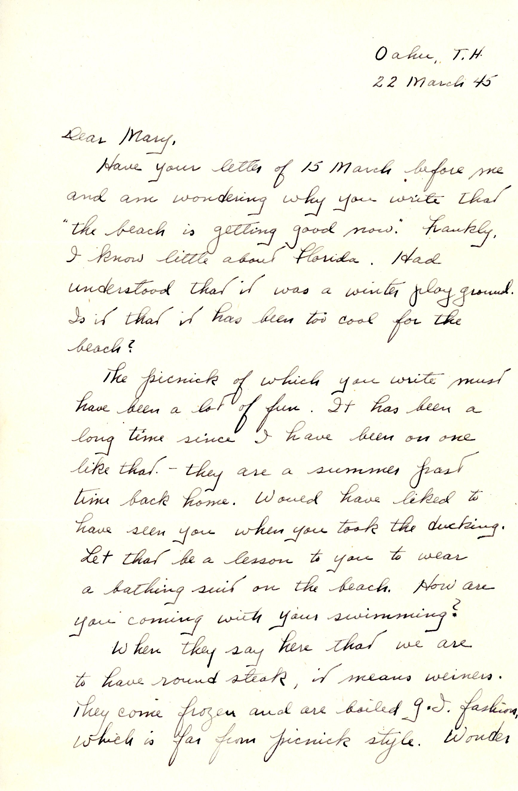
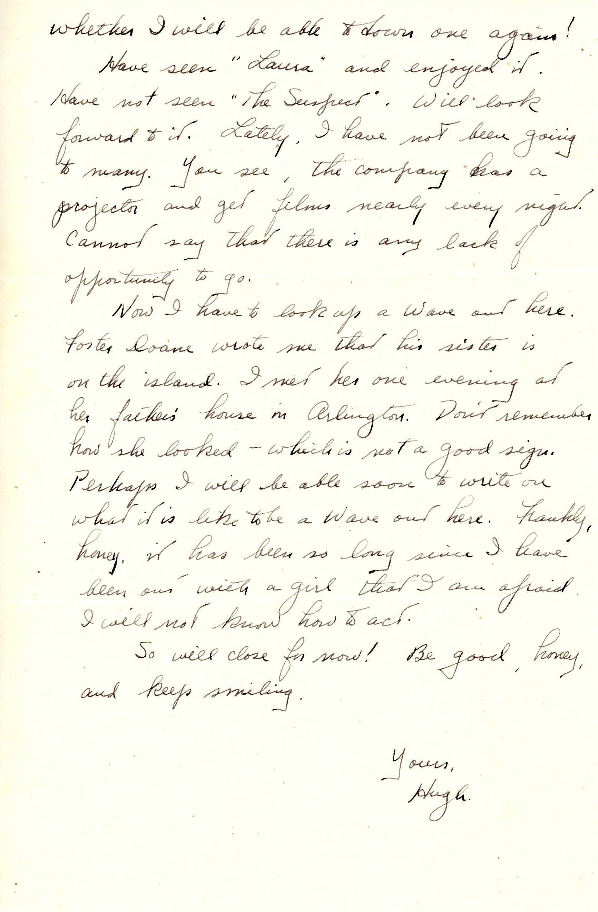

 {}Dad comments on a Pensacola picnic where Mary got dunked. He is trying to locate another WAVE in Honolulu, a sister of his benefactor and former boss at the Fort Edward, NY paper mill,  Foster Doane, Jr.  This WAVE was probably Dorothy Doane (1909-1990), who he met when invited to dinner at the elder Doane's home in Arlington, MA while studying at MIT. He doesn't remember her, or so he says. {}

| |
|:---:|
|*Mary on the beach at Pensacola NAS, probably not sent to Dad as it is as-new*|

