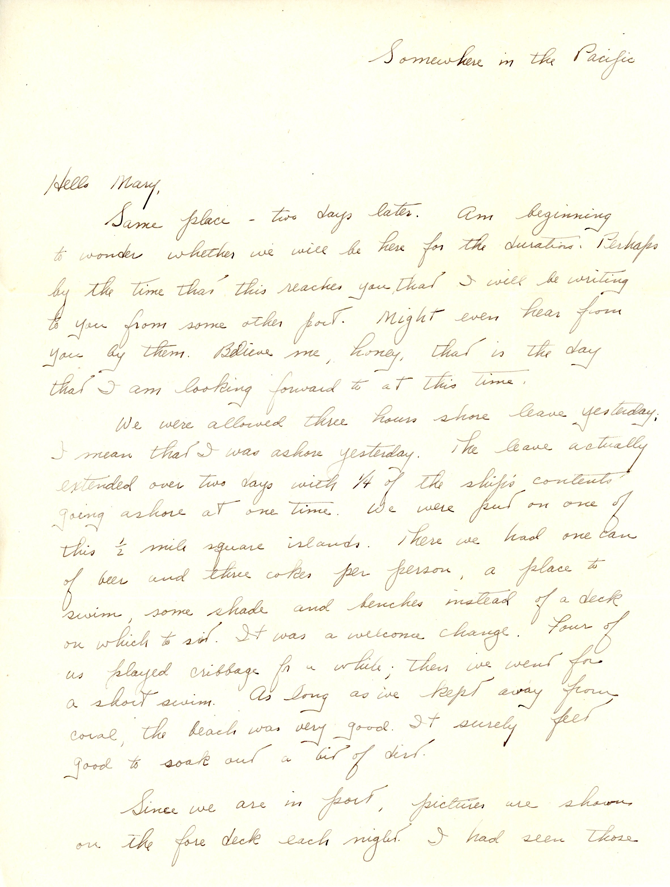

 {}The Battle of Okinawa began (at least officially) on 8 April 1945.  Dad apparently was shipped out of Honolulu soon thereafter, although there was clearly a previous letter which I do not have, since this one is "two days later".  The Navy transport ship has stopped at a tiny island, perhaps somewhere near Okinawa,  and Dad gets some leave and a swim. The Navy has better food (mess) than Dad had experienced with the Army.{}

![page 2](img084.jpg

