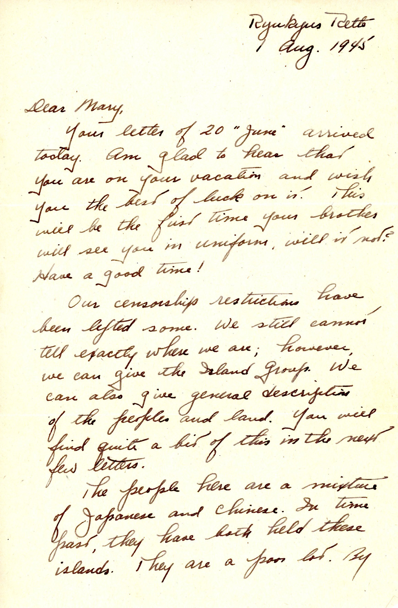
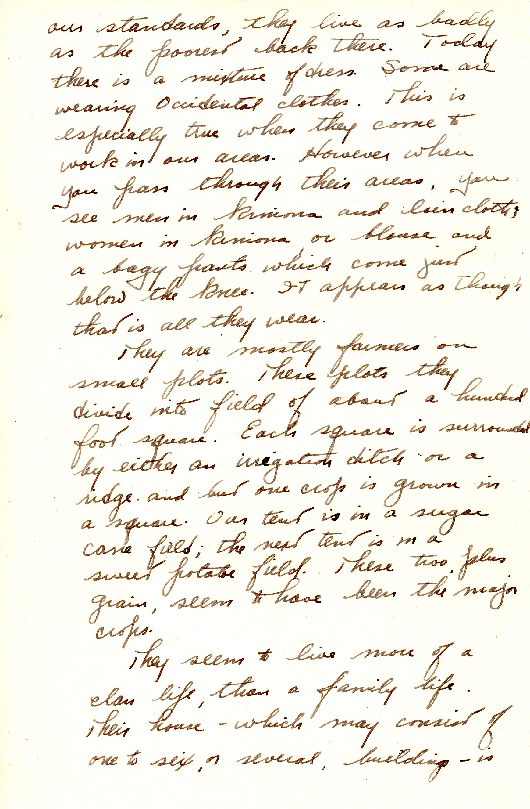
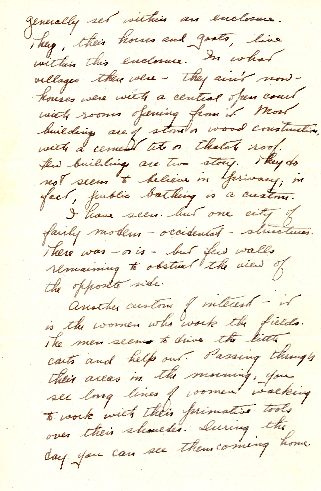
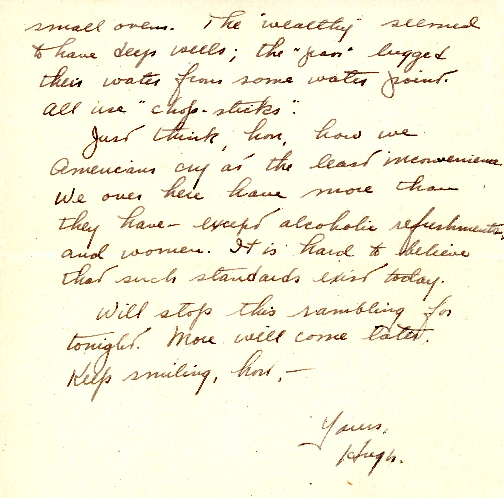

 {}Dad has heard that soldiers are getting home from the European Theater of Operations (ETO), but the Pacific war goes on and, with few "points" accrued, Dad expects a long stay.  After the War, he plans to finish his last semester at "Tech" (MIT) and maybe propose to someone. {}

| |
|:---:|
|*Okinawa scenes, Dad in trash, Dad and unidentified soldier at tent*|

