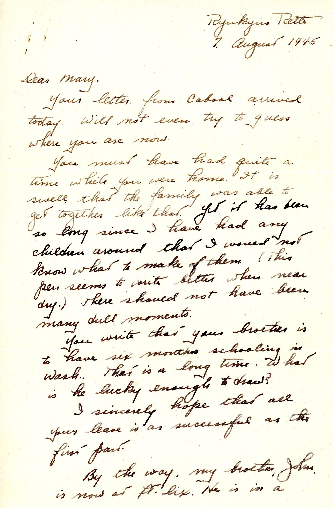
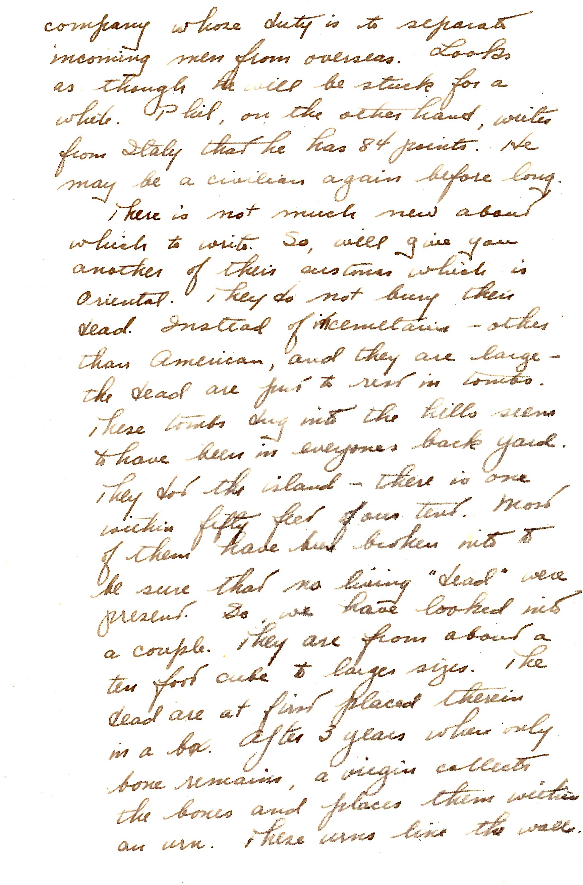
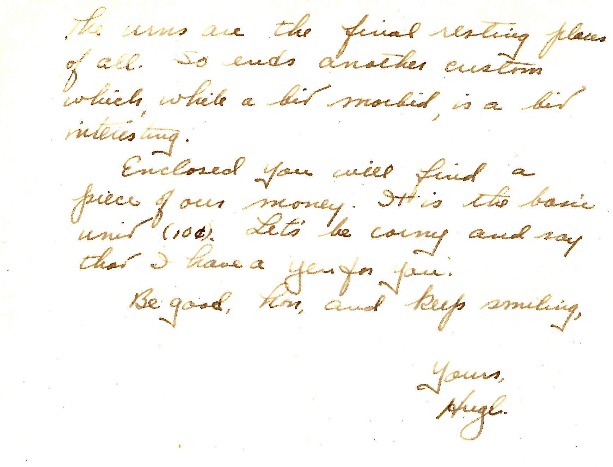

 {}Dad visits an Okinawan cemetery, perhaps adjacent to his tent. No mention of the Hiroshima bomb of the day before, perhaps not then known.{}

| |
|:---:|
|*An Okinawan "turtleback" or *kamekobaka* tomb with a remarkably well-preserved "Omega-shaped" protective wall as *feng shui* to guard ancestors' *qi*. The house-like structures are also *Haka*-style tombs.  The wartime use of these tombs by the Okinawans is movingly told in the novella "Turtleback Tombs" by Oshiro Tatsuhiro (1966) available in translation in "Southern Exposure - Modern Japanese Literature from Okinawa (Molasky and Rabson, 2000)*|

| |
|:---:|
|*An (occupation) Yen for Mary*|

