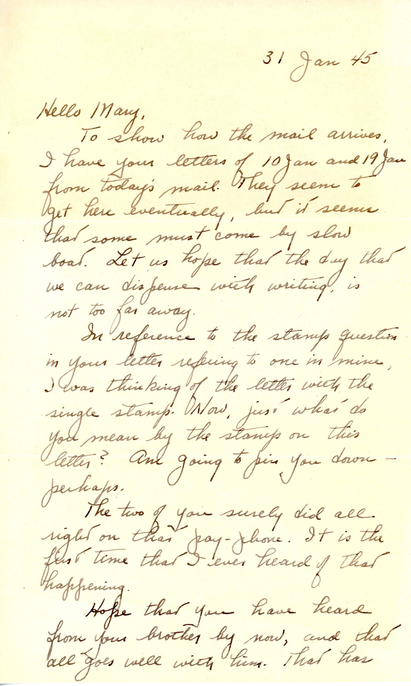
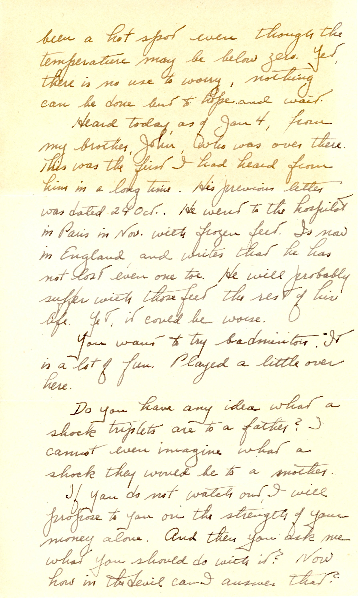
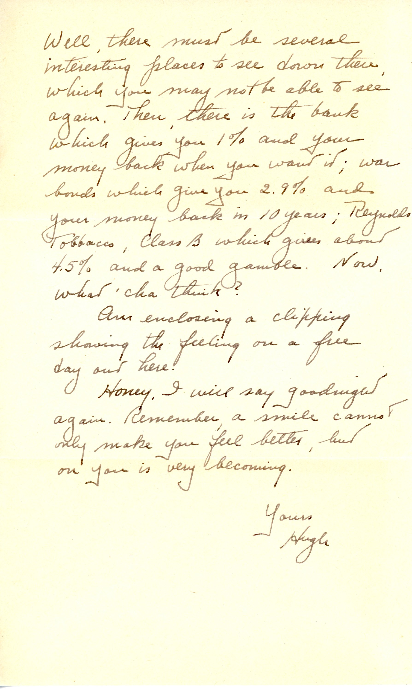

 {} Dad reports that his brother John suffered frostbite in France, but lost no toes (his feet were a bother all his life).  Mary's brother David Potter was also in France (Army Intelligence) which is a cause for worry. Dad is impressed with Mary's pay grade and has a few investment ideas! {}

| |
|:---:|
|*Army Life "free day" even in Honolulu (fair use for genealogy)*|

