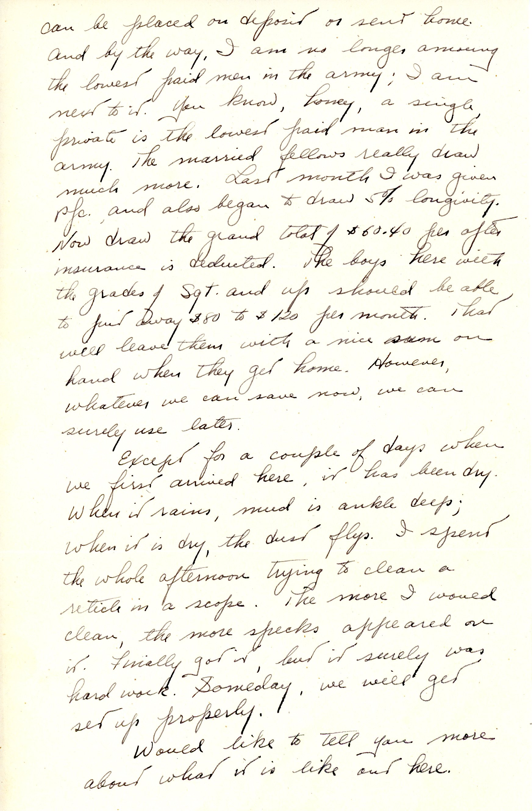
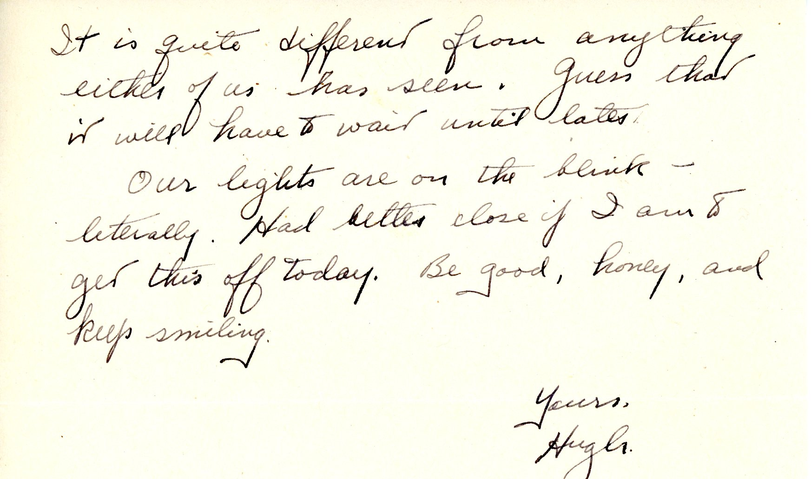

{}Dad's ship has finally arrived at its destination (Okinawa, as we know now). We can be reasonably certain that Mary did not fly to her leave destination, as she saw far too many training flight crashes in Pensacols NAS, took them rather personally and never-ever flew anywhere. V-E day was Tuesday, May 8, 1945, back when Dad's ship was nowhere in particular.) {}

