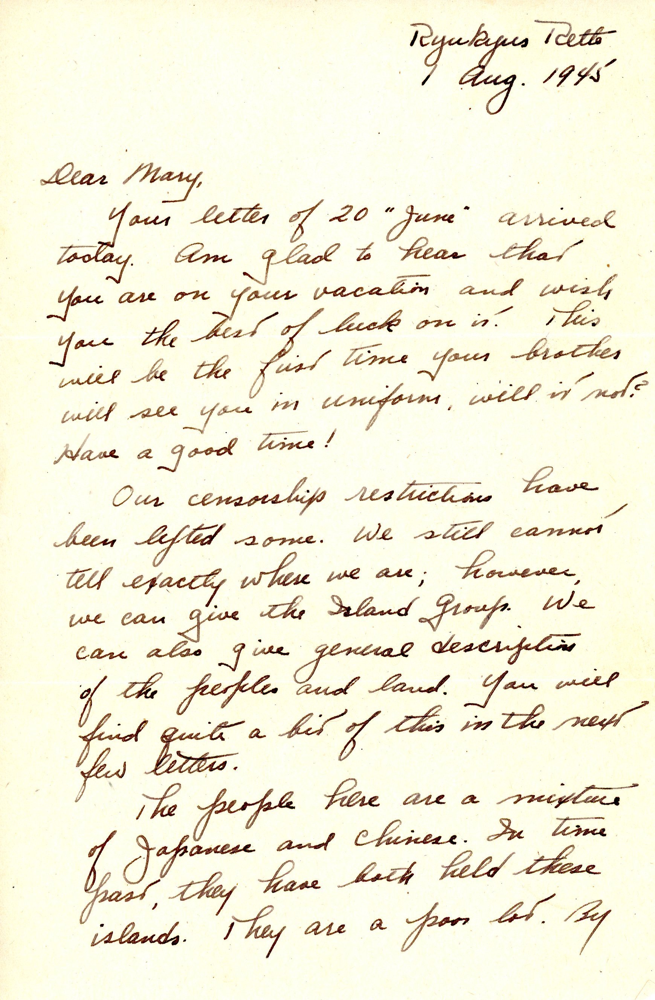
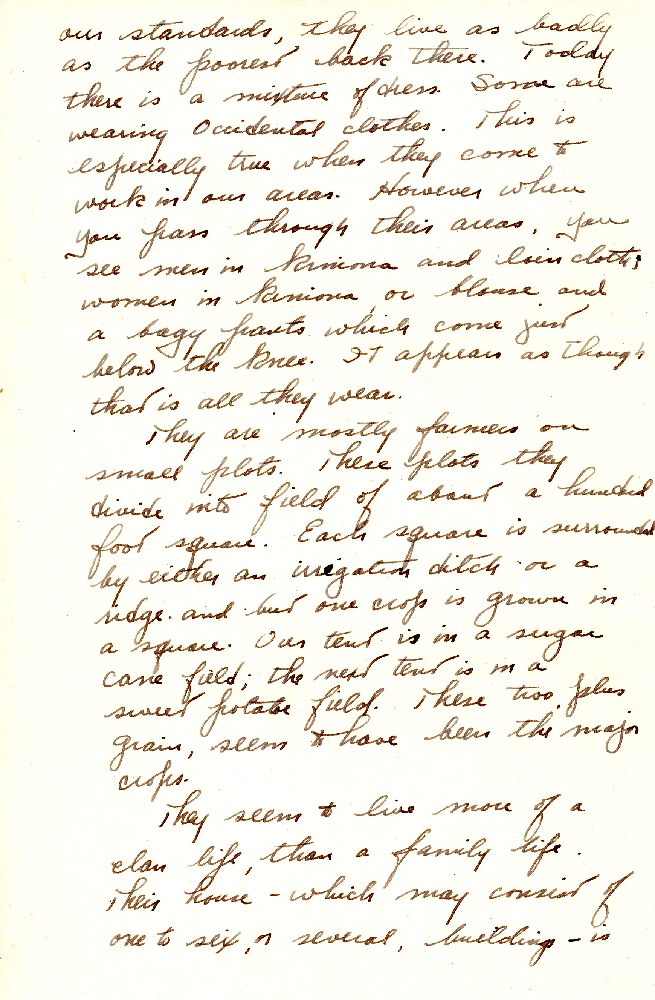
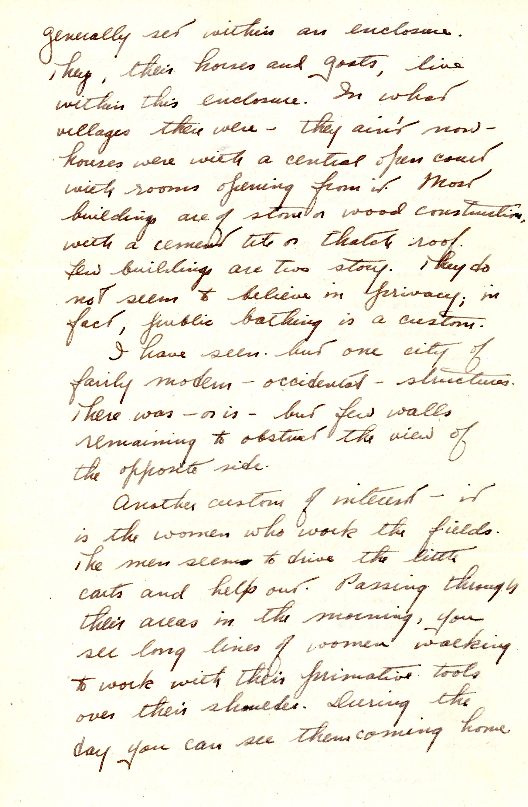
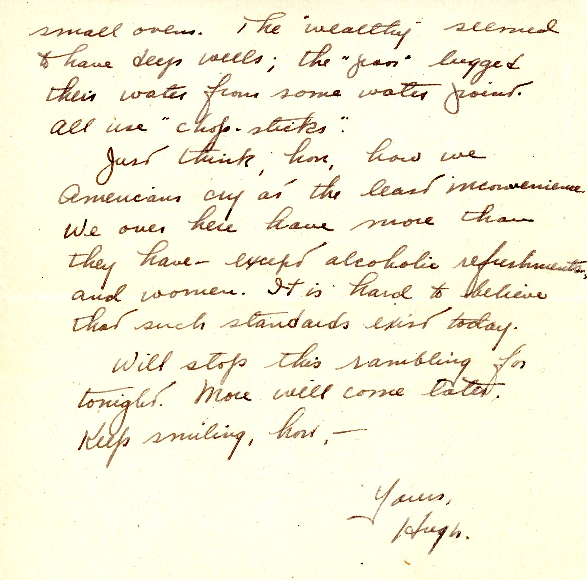

 {}Censorship has been reduced, at least to the extent of describing Okinawa as "Ruykyus Retto." Dad provides an interesting description of the Okinawan residents. {}

| |
|:---:|
|*Okinawa scenes, Dad in trash can with camp background, Dad and unidentified soldier at tent, possibly in a "cane field"*|

