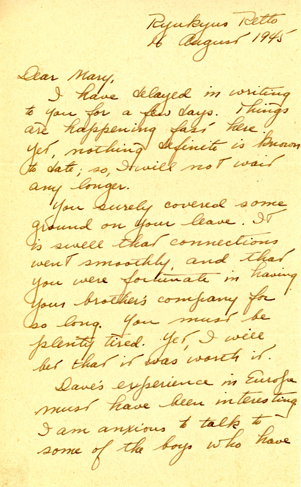
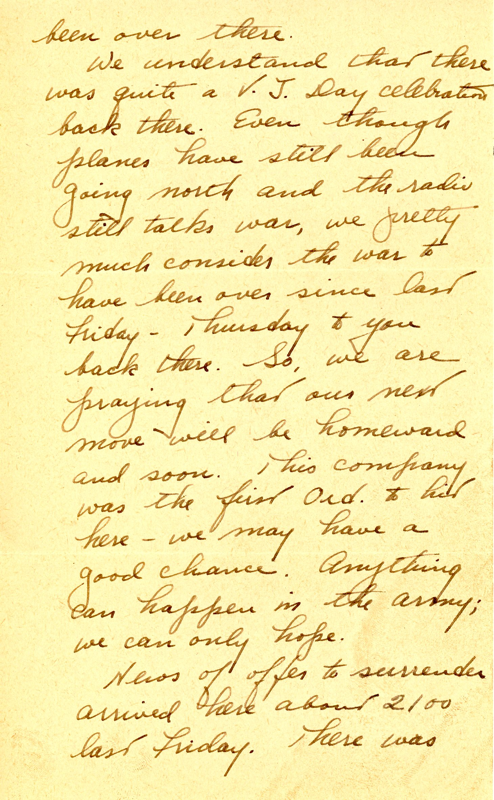
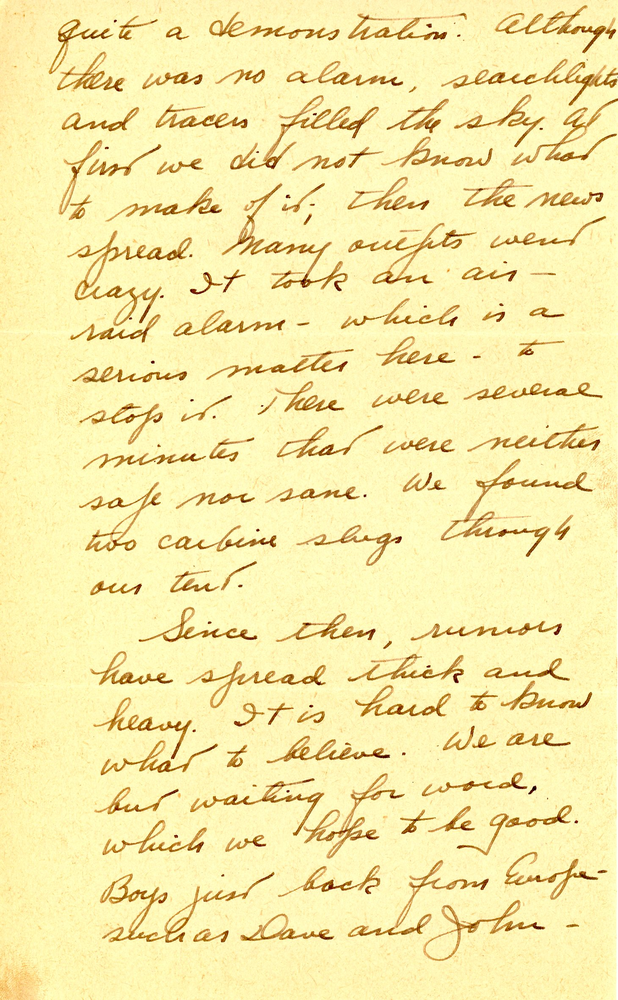
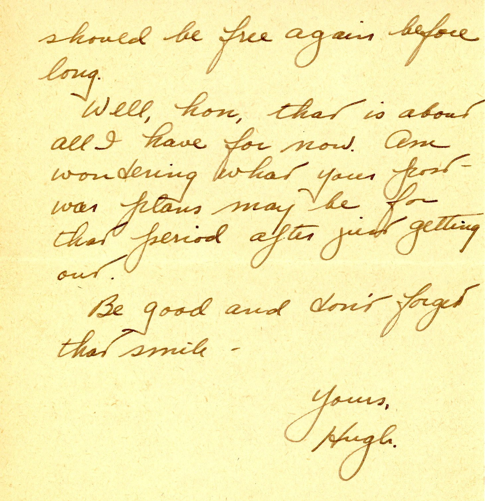

{}The Victory over Japan celebration in Okinawa (on Thursday, August 10 in this letter...which was actually the date the Japanese accepted the Potsdam Declaration, while the formal surrender of the Emperor (August 15, 1945 in the Japanese Time Zone) is now the official VJ Day.  The August 10 celebration is crazy and out-of-control on Okinawa, resulting in bullet holes in Dad's tent (and a few soldiers killed by falling lead, as we know now).  Air raid sirens break up the party at last.{}
{}Dad mentions being with the first "Ord" (Ordnance) groups to arrive in Okinawa, being a few miles from the front lines and subject to some less-than-successful Imperial Japanese ground attacks. I can't square this info with the dates of earlier letters announcing Dad's ship's arrival at its destination on June 4, 1945. {}

