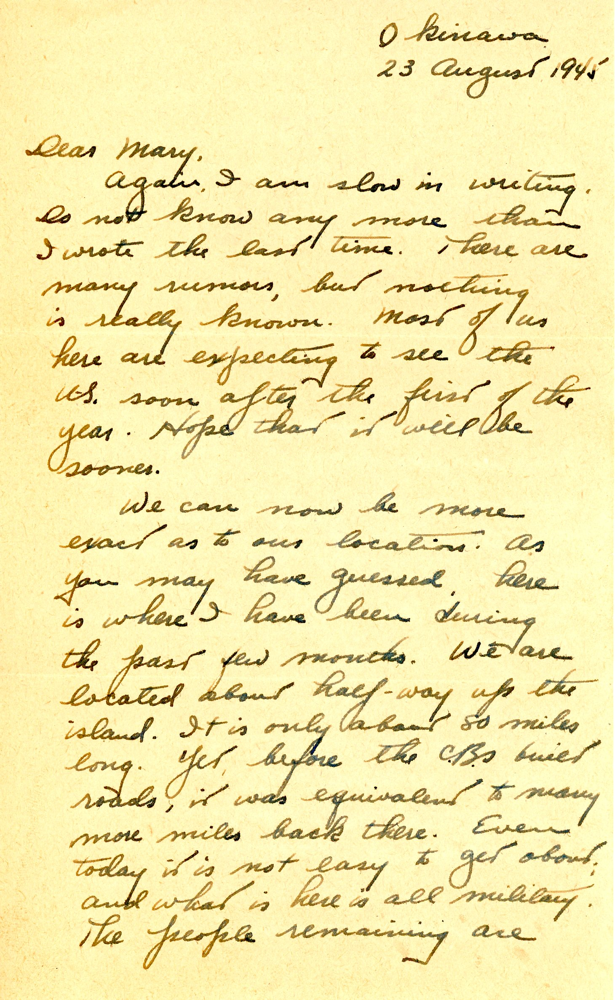
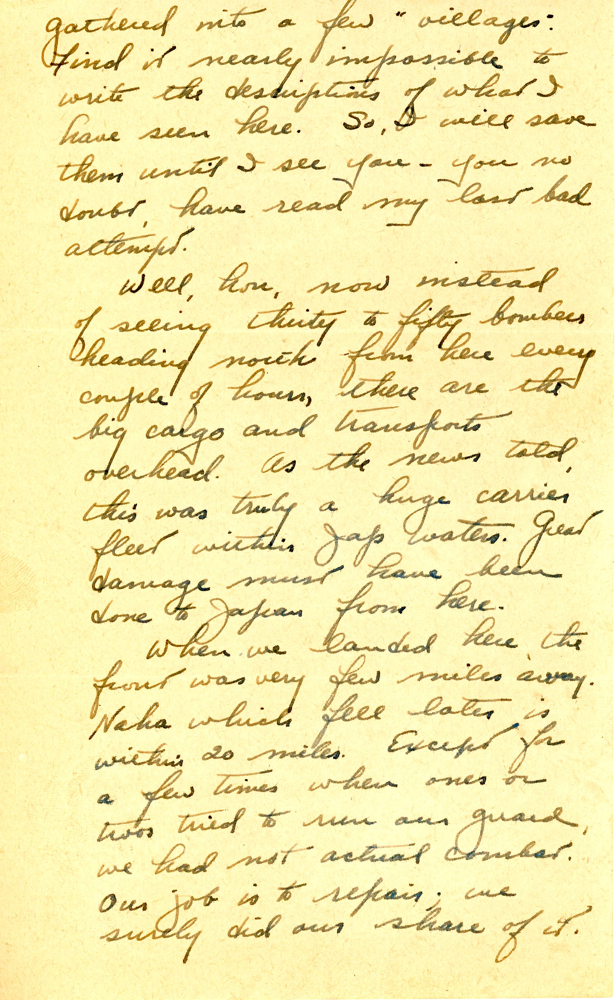
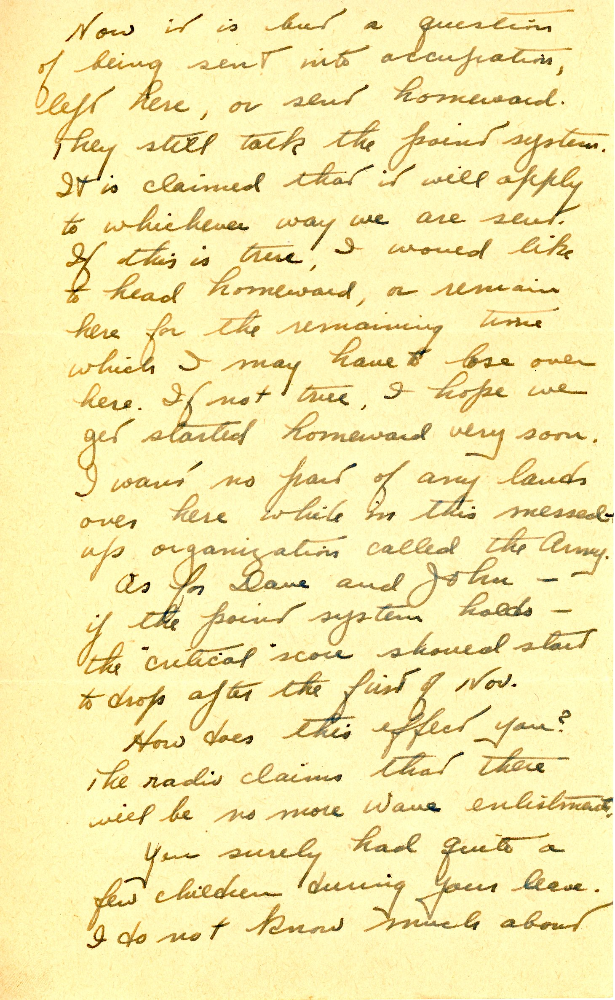
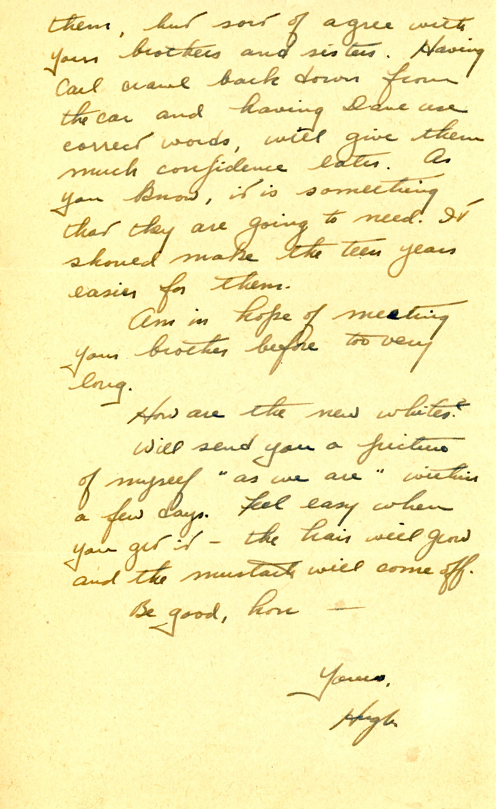

{}Dad can be rather direct about his location now, about half-way up the island of Okinawa, 20 miles or so from the ruins of Naha.  "Villages" (polite for internment camps) house the remaining population of the island, and Dad cannot describe the conditions there.{}
{}As in the last letter, the chronology of this one contradicts the date/location of some earlier letters. {}

| |
|:---:|
|*Battle of Okinawa.  Dad's self-reported location is about 20 miles from Naha, somewhere just south of what is now Kadena AFB*|

