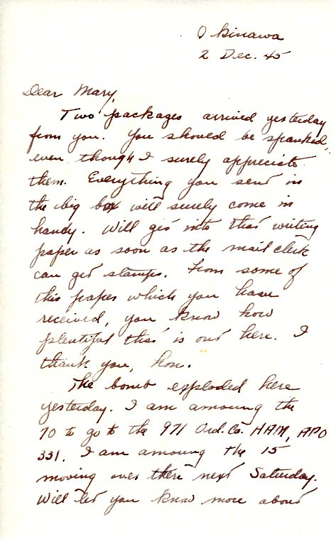
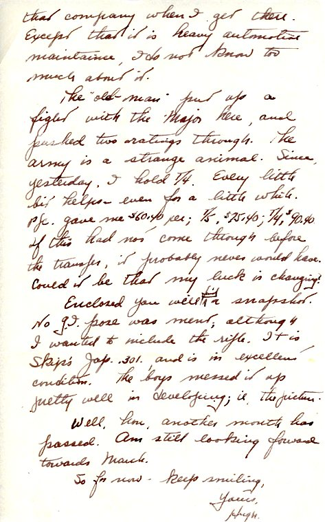

| |
|:---:|
|*As described in the following letter, Dad with tentmate "Skip's" Japanese 0.301 rifle*|

| |
|:---:|
|*"Pappy" Littlepage holding what looks like the same rifle. From the collection of Cloy's niece, cm2texas on Ancestry.com, used with permission*|
