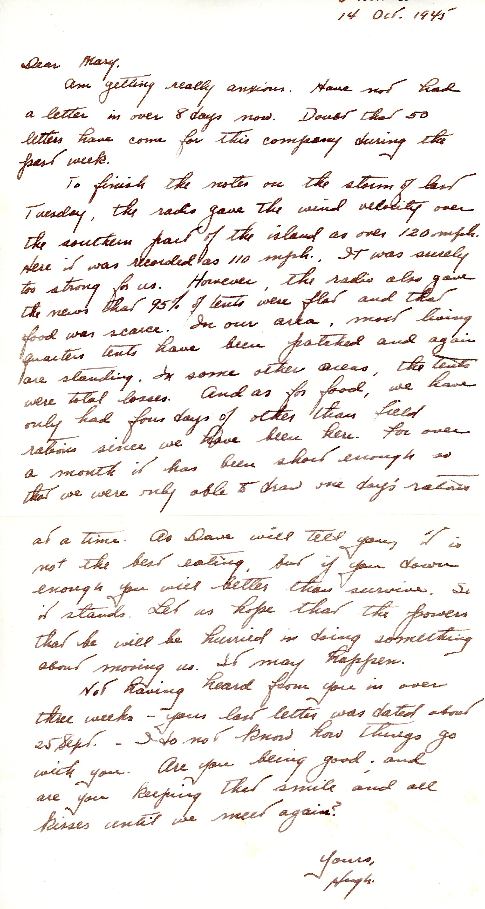

{}Dad, with no incoming mail for weeks now, reports on the damage from Typhoon "Louise."  The typhoon was actually much more destructive to the Navy, with some 200 vessels damaged or lost and numberous casualties.  Good thing the War was over. {}

