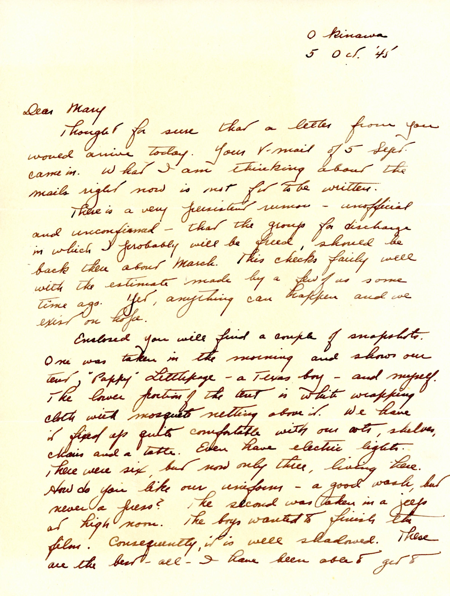

{}Dad sends two snapshots; one of himself an "Pappy" Littlepage, most likle Cloys  Littlepage (1913-2001)and a second photo of Dad and a Jeep.{}

| |
|:---:|
|*As mentioned in the letter, a photo of Dad and "Pappy" Littlepage at their tent*|

| |
|:---:|
|*As mentioned in the letter, Dad in a Jeep adapted to Ordnance use.*|

