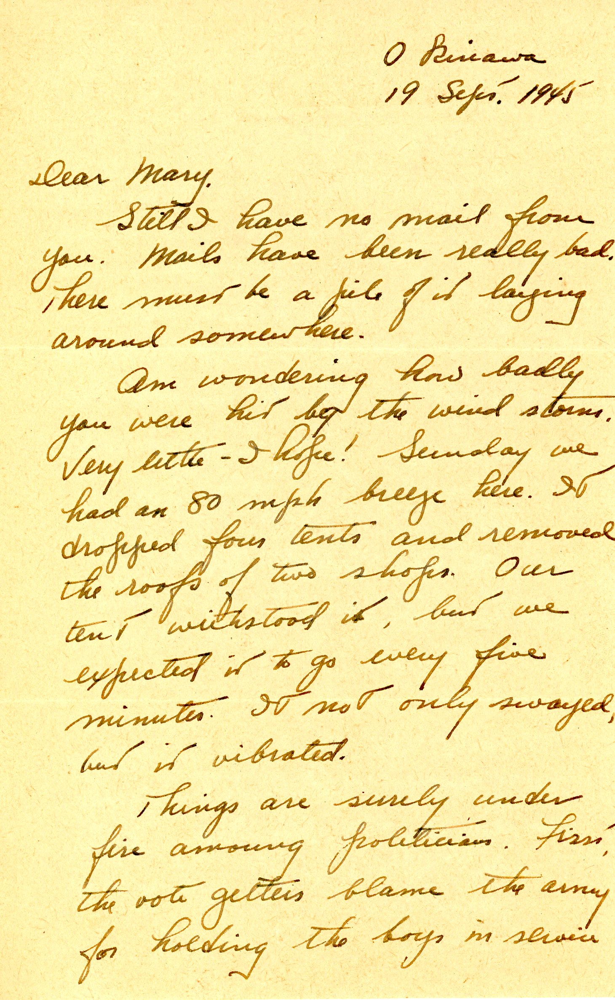
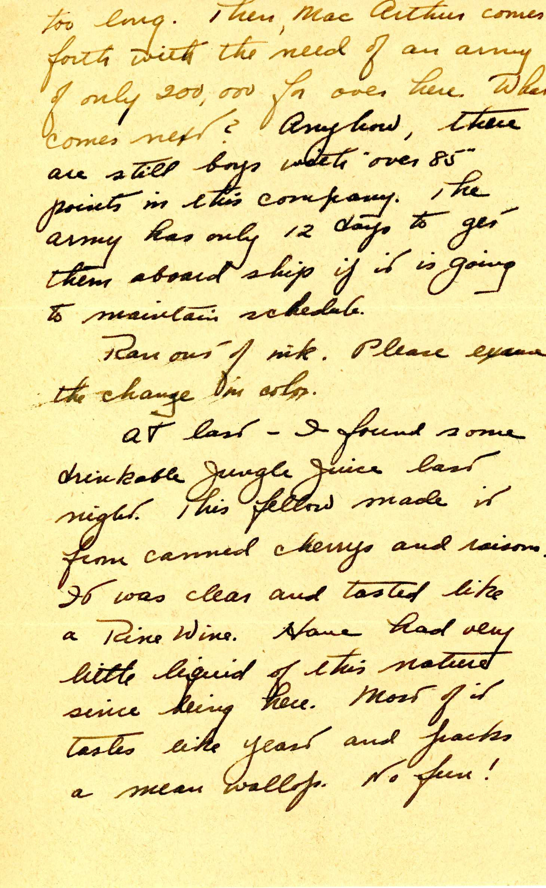
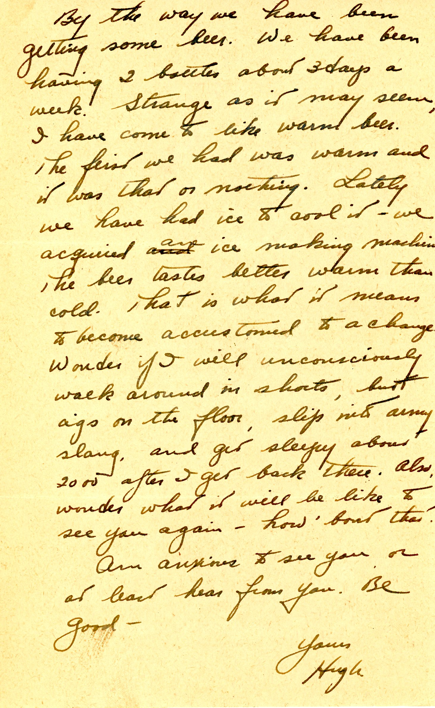

{}The windstorm Dad asks about was the Homestead Hurricane of September 1945, which caused much damage to Miami, Florida and vicinity.{}
{}The "drinkable Jungle Juice" and warm beer situation is sad, as Okinawa had a fine tradition of *awamori* high-proof rice distillate, much of it well-aged, but destroyed in the shelling/bombing. It took some years to re-establish the spirits industy. {}

