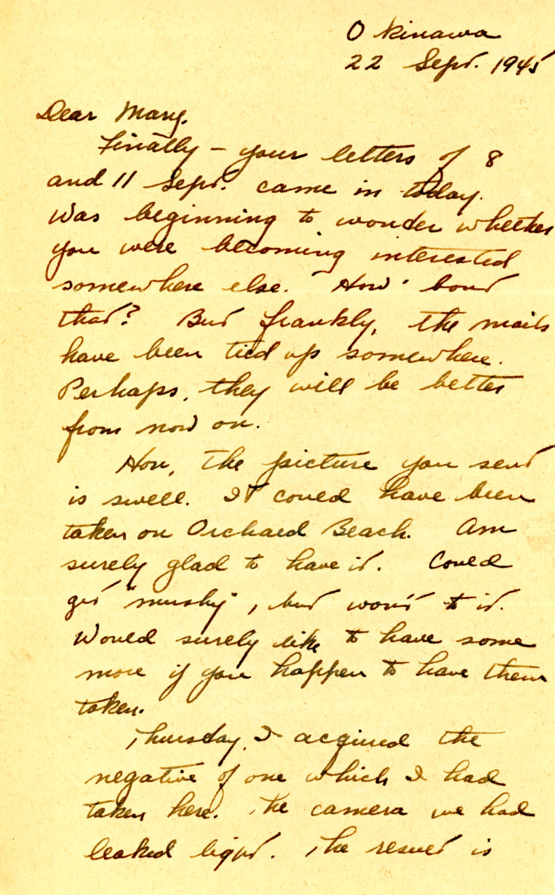
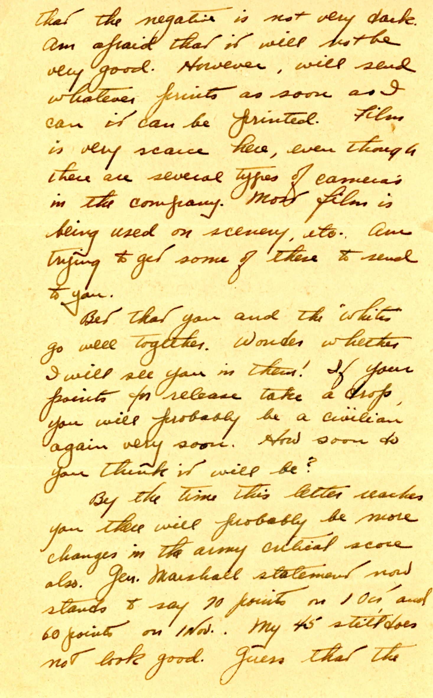
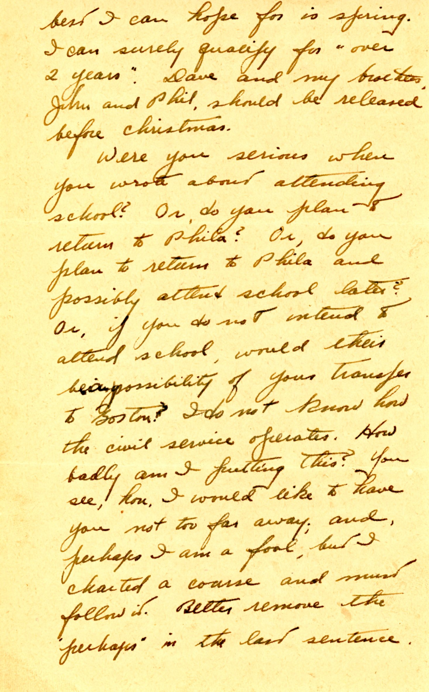
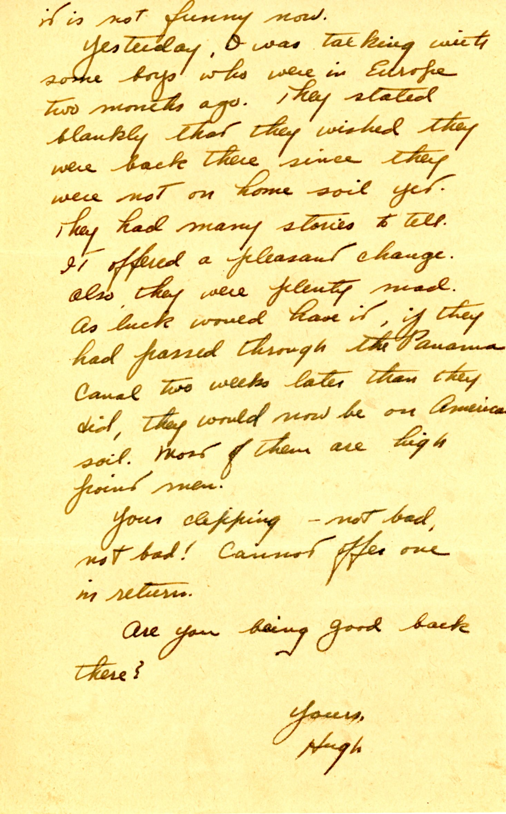

||
|:---:|
|*Dad and Jeep, part of Army Ordnance duties, taken with a light-leaking camera but developed anyways*|

{}With only 45 "points" accrued, Dad is still likely stuck in the Army for some months as the official targets will still be 60 in November.  I believe points accrued one per month, plus one extra per month of service abroad.  Extra for medals and dependants which Dad does not have.{}

| |
|:---:|
|*Some views of an R&R Area at Pensacola NAS*|

| |
|:---:|
|*Probably the beach picture Dad mentions in this letter.*|

