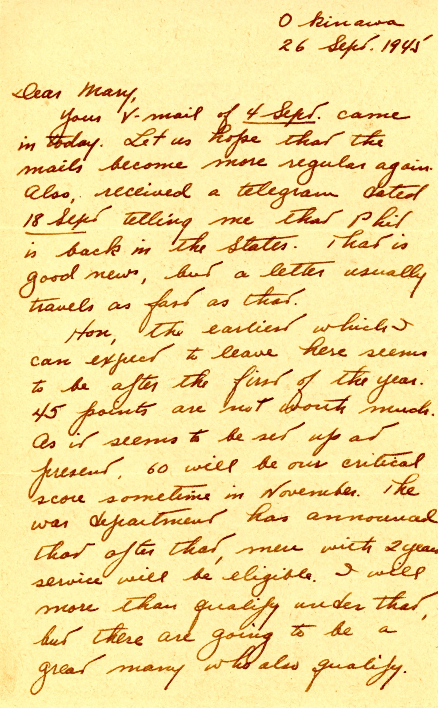
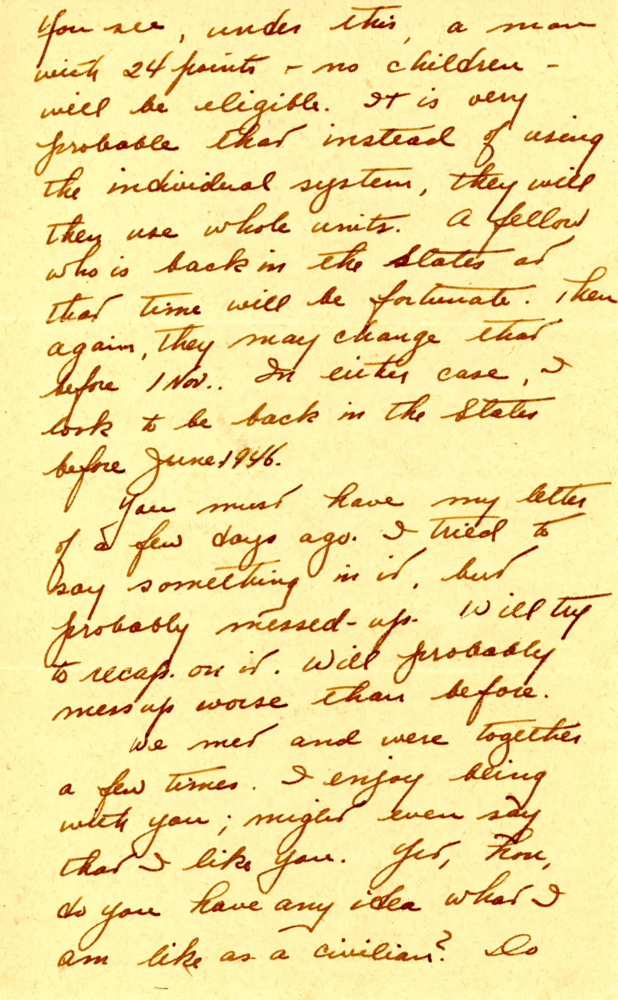
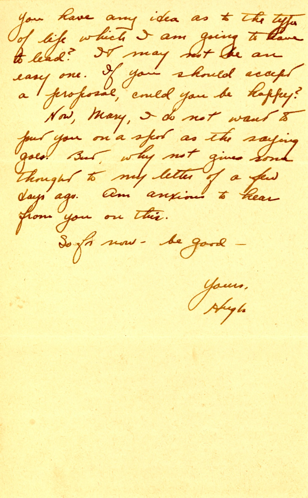

{}With mail service messed up, Dad seems concerned about Mary's possible response to his rather off-the-cuff "proposal" in the previous letter, and tries to be much more direct and cautionary.  Mary, of course, had no idea what her future life would be like when married to a technical consultant to a paper company (long and irregular work hours, much travel, life in small towns). I think these all bothered her later on.{}

