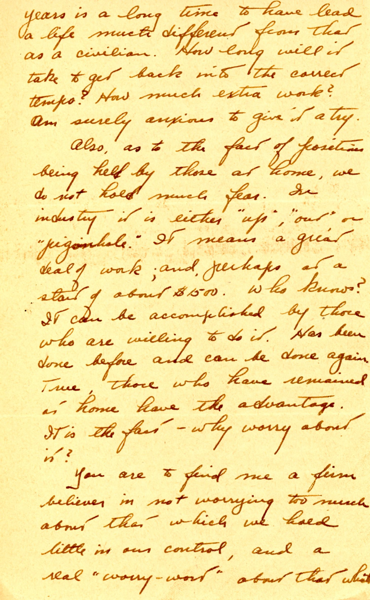

{}Dad even further "walks back" his rather random proposal to Mary of the last two letters. Employment post-war seems to be on everyone's mind; Dad eventually got his paper industry tech job at a salary much below what Mary had been earning in the Civil Service, and even the WAVES. Fresh food on Okinawa is going mostly to former POWs, who are often in bad shape.{}

