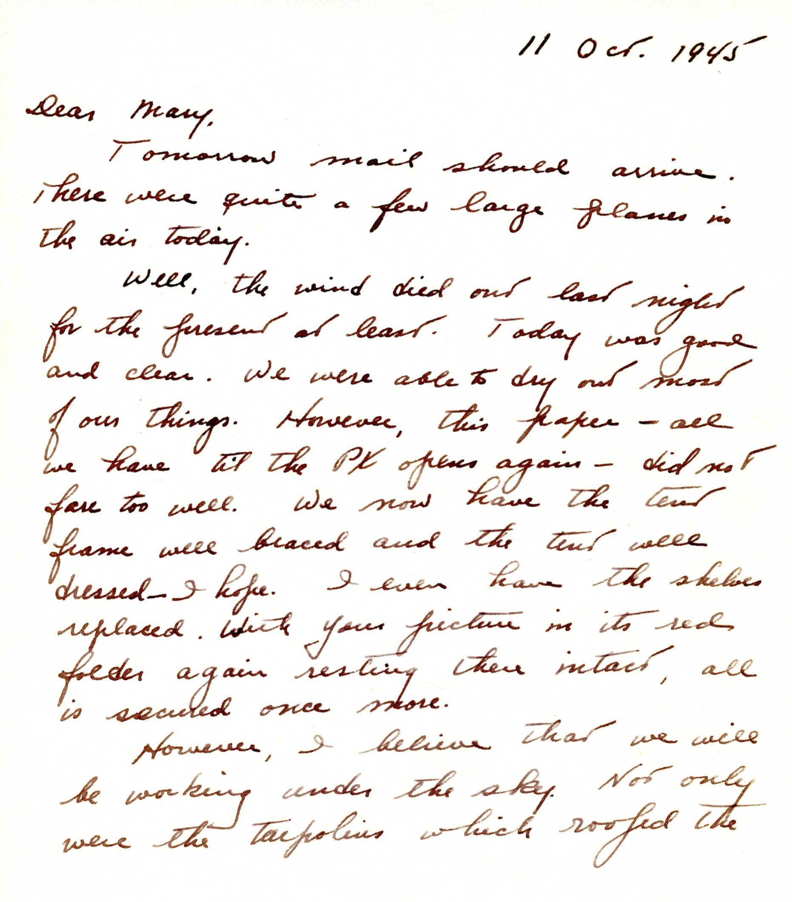
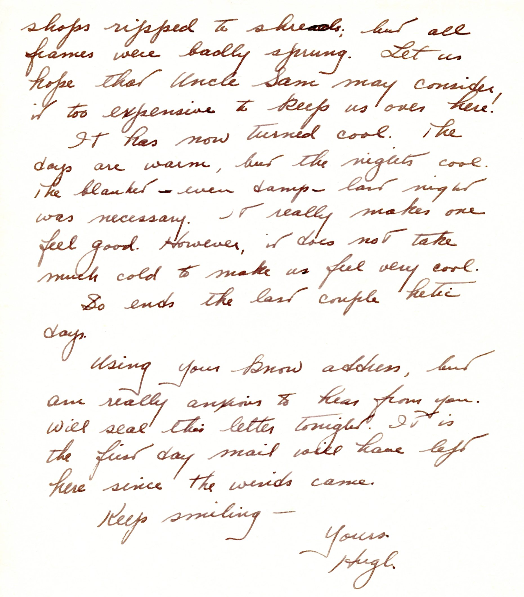

{}Typhoon "Louise" passes and the destruction is mostly fixed up, except for the "Shops," whose tarp covering  was shredded.{}

| |
|:---:|
|*A picture of the post-typhoon remains of the shops (image from Cloys Littlepage's photos, courtesy of cm2texas at Ancestry.com.*|
