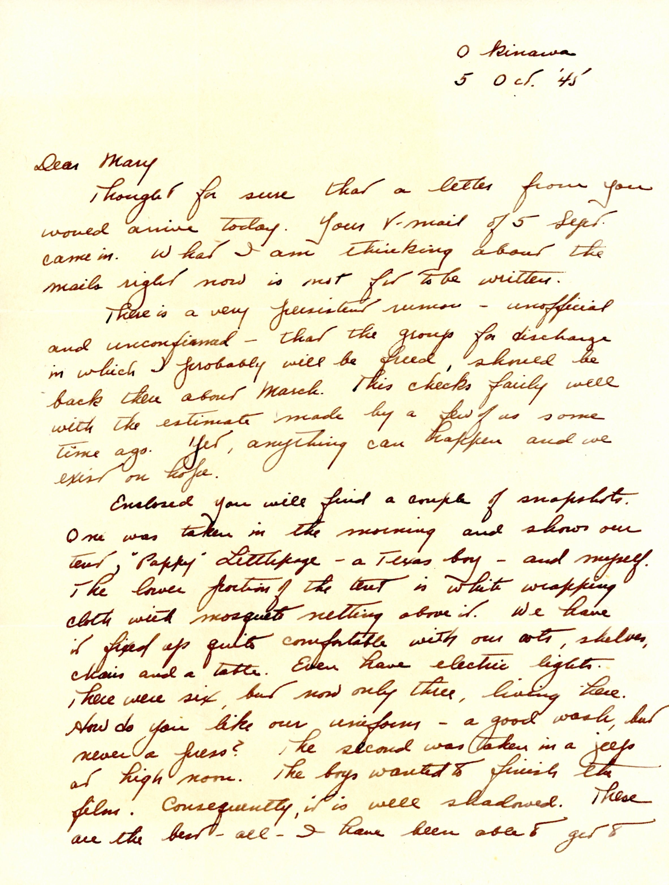
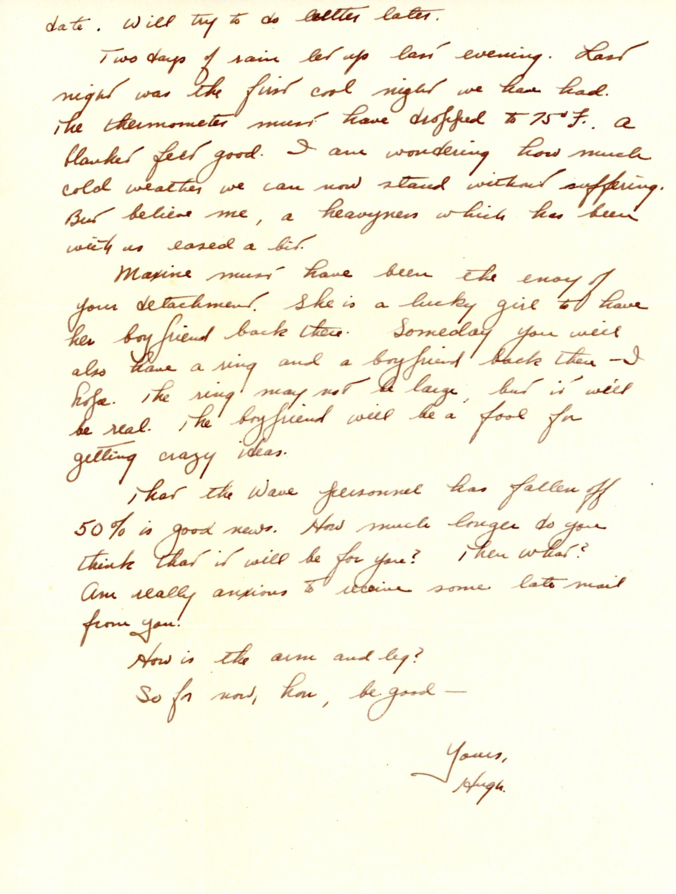

{}Dad sends two snapshots; one of himself and "Pappy" Littlepage, most likely Cloys Littlepage (1913-2001), and a second photo of Dad and a Jeep. The cooling breezes Dad reports in this letter turn out to be the leading edge of Typhoon "Louise", which will knock the tent and "Shops" (and much of the rest of Okinawa) flat on October 9, 1945.{}

| |
|:---:|
|*As mentioned in the letter, a photo of Dad and "Pappy" Littlepage at their tent in Okinawa*|

| |
|:---:|
|*As mentioned in the letter, Dad in a Jeep adapted to Ordnance use.*|

| |
|:---:|
|*Another picture of the Jeep, this time with "Pappy" Littlepage at the wheel (photo courtesy of Cloys' niece, cm2texas from Ancestry.com.*|

