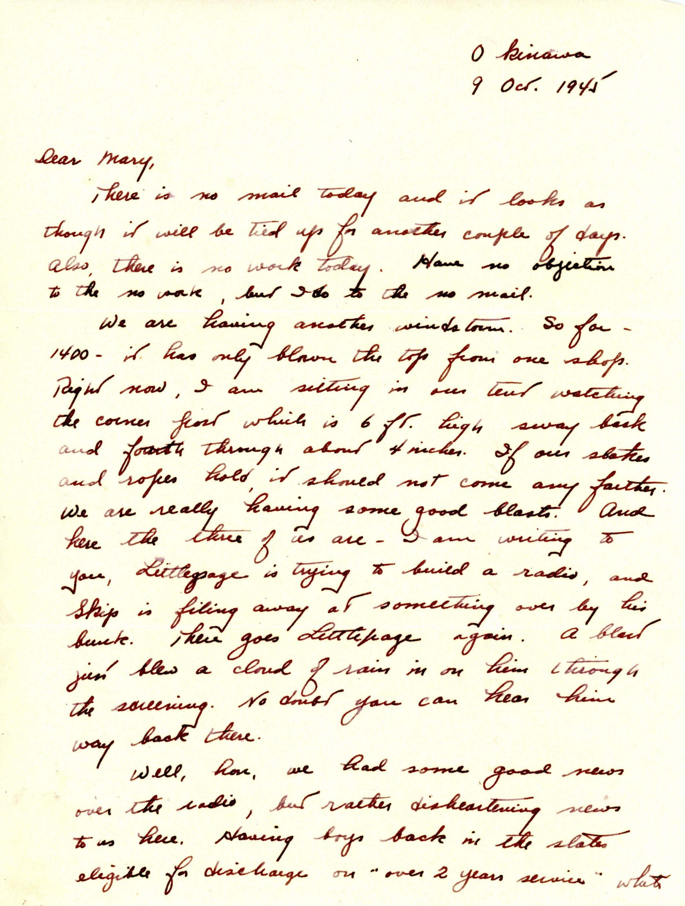
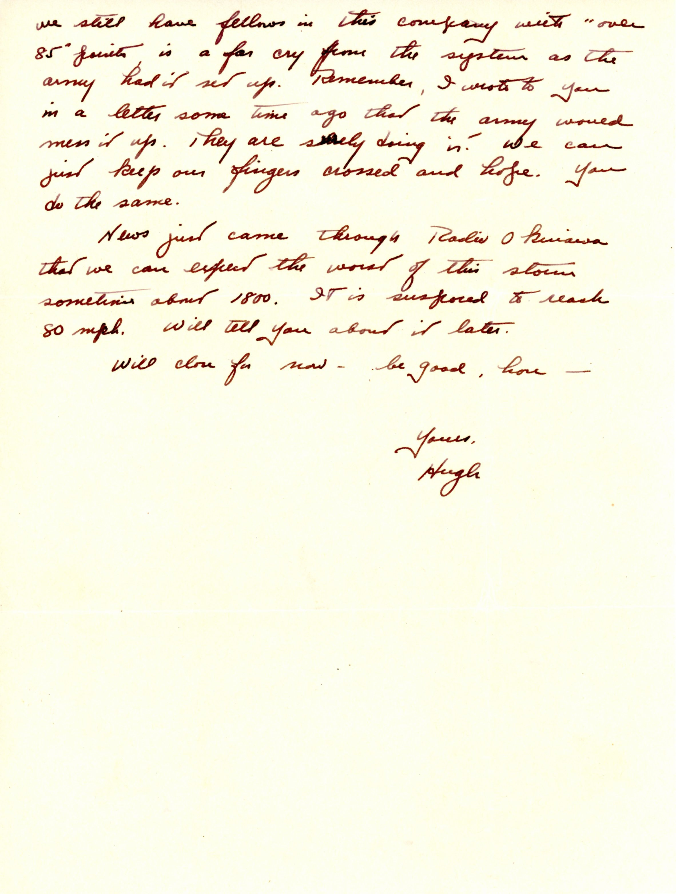

{}A bad "windstorm" (actually Typhoon "Louise" which was very destructive over the next few days) comes ashore on Okinawa, shaking the tent.  Dad's tentmates "Pappy" Littlepage and "Skip" are keeping themselves busy until a sudden gust blows a "cloud of rain" in on "Pappy".{}

