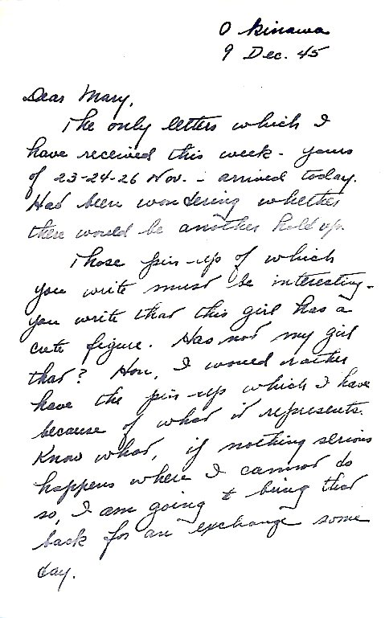
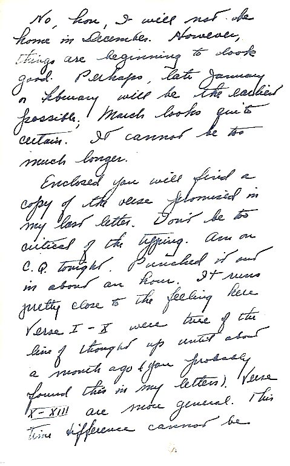
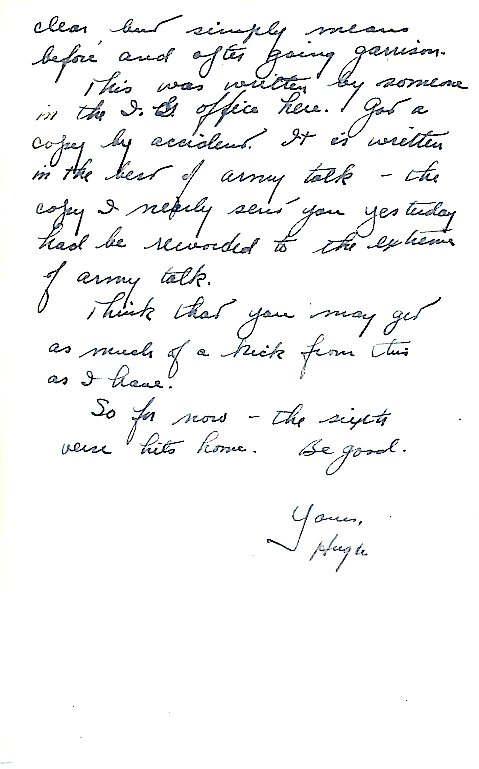
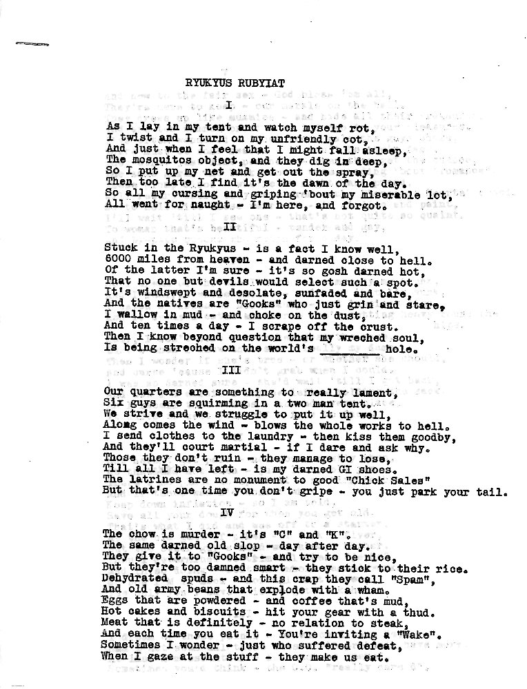
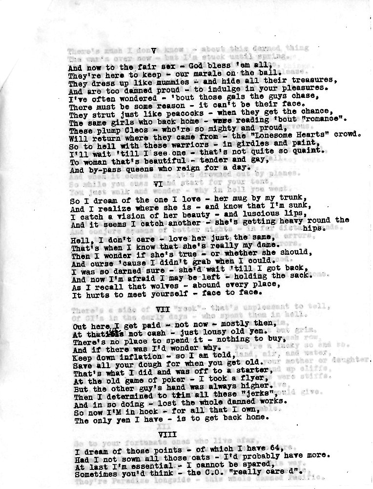
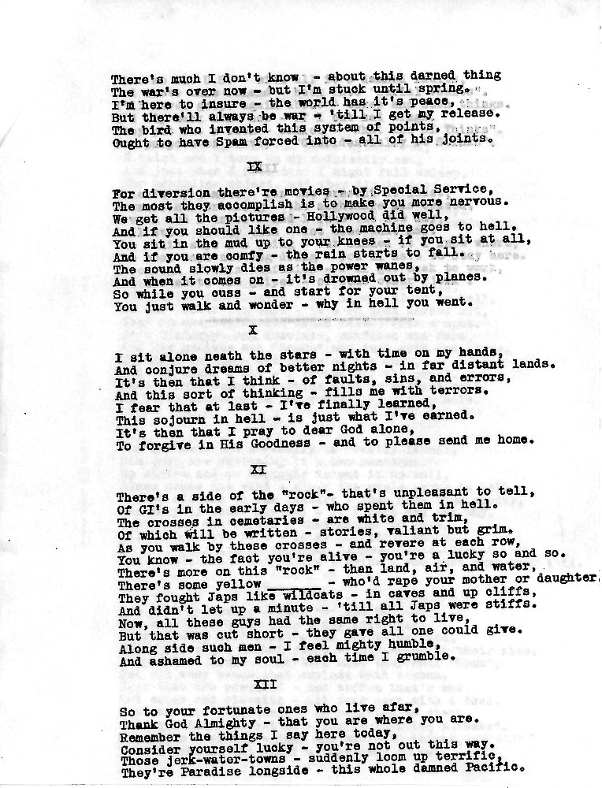
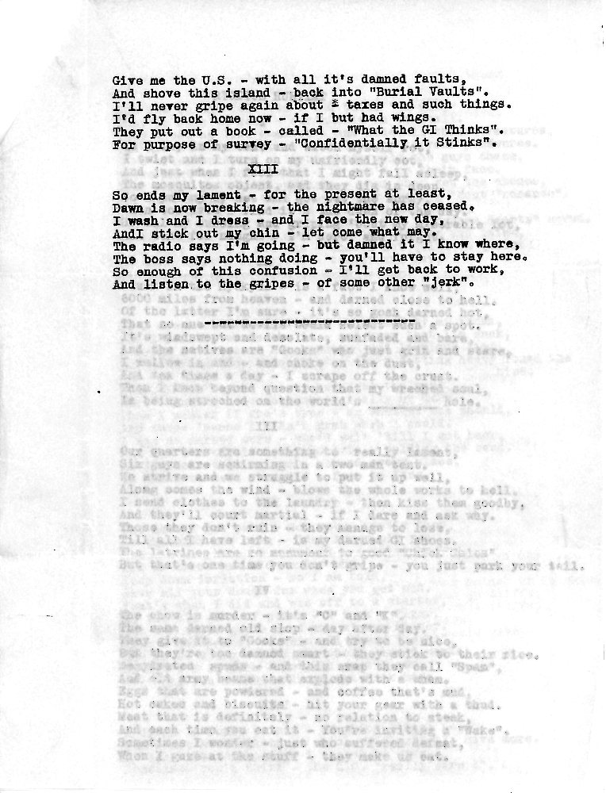

{}Dad spent his evening on C.Q.(Charge of Quarters, or assigned work on off-duty hours) typing out the epic which follows, which was authored by someone in the Inspector General's office, Okinawa. The version sent to Mary is clearly a carbon-copy, so this got passed along further, samizdat-style. {}

{} Dad typed out the following, with some moderation of "Army" talk, but the "Rubyiat"  still contains stuff offensive to contemporary sensibilities.  You are warned!{}

