{}Extreme noise in the tent as "Pappy" Littlepage works on getting maximum volume from his newly-build 14-tube radio (fourteen!) while "Skip" goes after some project with an electric drill. Dad then goes with a friend  for a drive around Okinawa, and sees much destruction{}

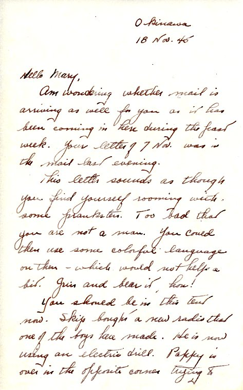
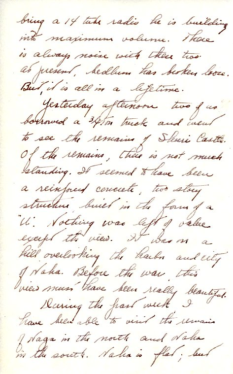
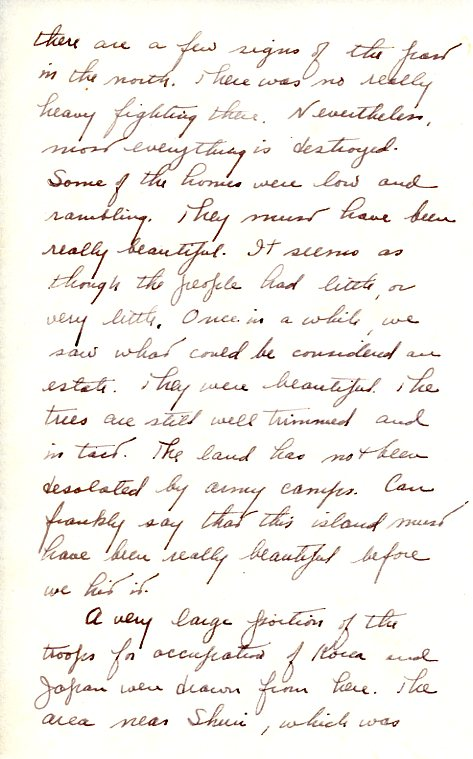
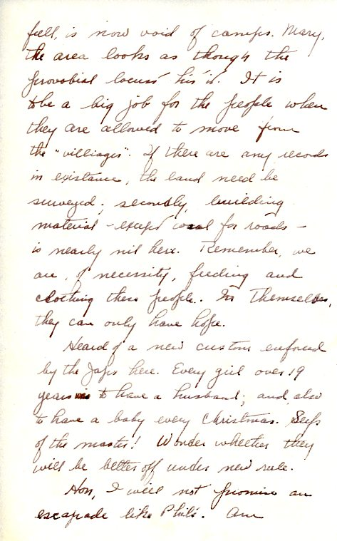
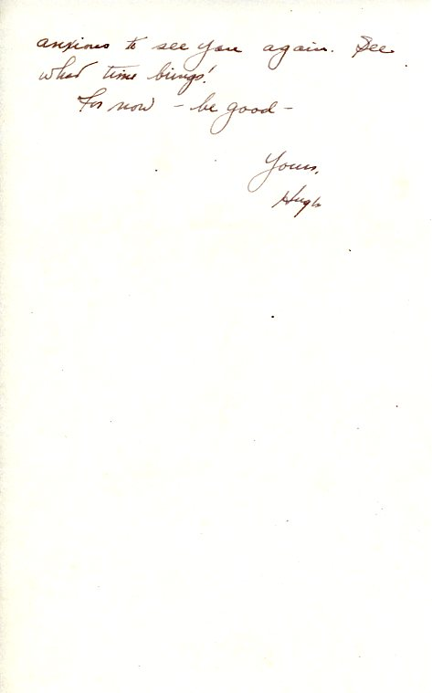

| |
|:---:|
|*"Pappy" Littlepage, in the tent shared with Dad, writing something.  From the collection of Cloy's niece, cm2texas on Ancestry.com*|

|Naha and Vicinity Ruins|From cm2texas' collection   |
|---|---|
|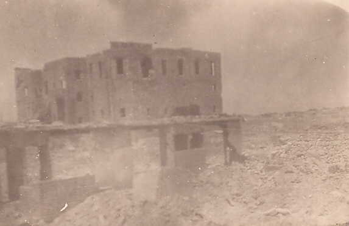|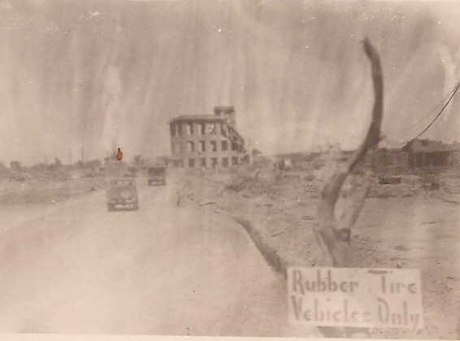|
|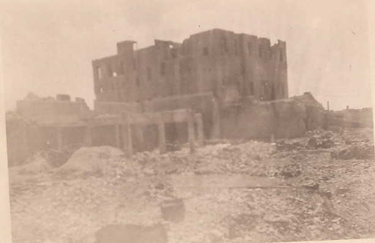|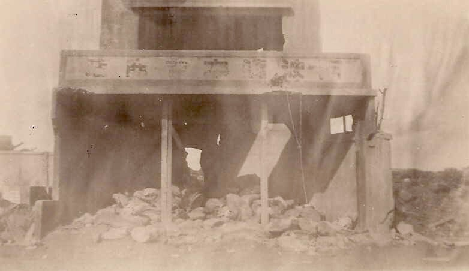|
|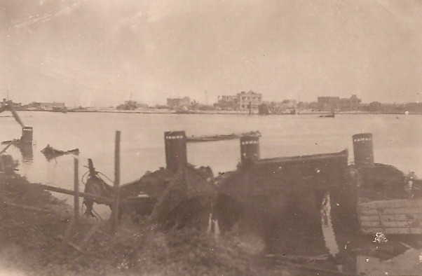|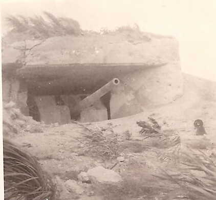|
|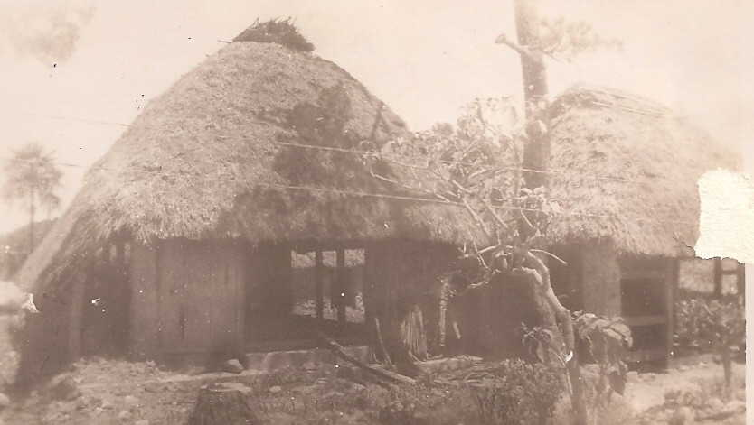|![Damaged US Tank}(BrokenTank.jpg) |
