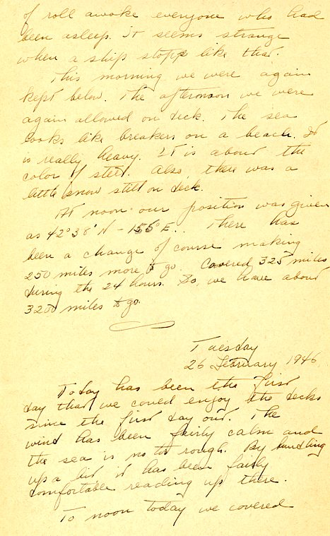
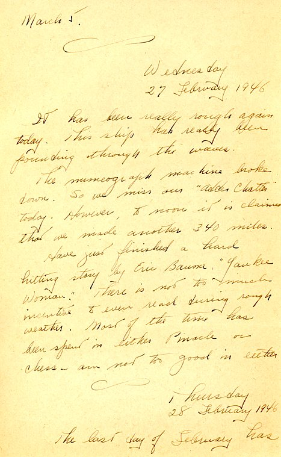

| |
|:---:|
|*The SS Marine Adder, on which Dad finally sailed for home, under way...date and location unknown.  At the time, the American Presidential Lines owned the Adder, but it was puchased by the Navy a few years later for use as a  Korean War troop transport. The ship had a capacity of 3,485 soldiers.  Credit:  Marion Douglas*|

{}Dad wrote a series of letters from the Marine Adder, which are a sort of Journal of his life on board.  They were mailed later, if at all. {}

